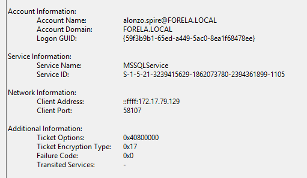
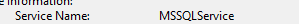
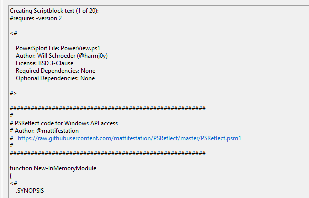
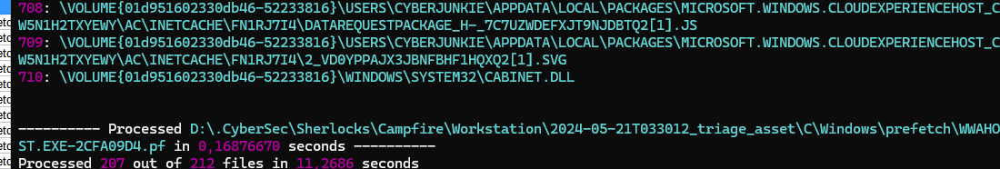
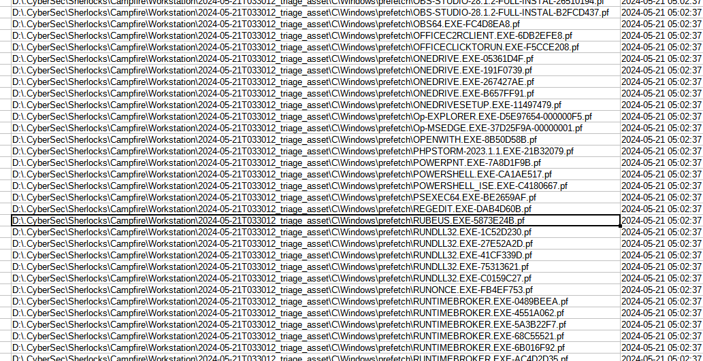
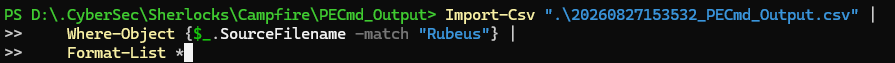
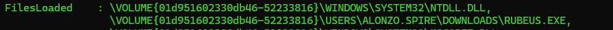

# Campfire Sherlock

## Sherlock Scenario

> Alonzo Spotted Weird files on his computer and informed the newly assembled SOC Team. Assessing the situation it is believed a Kerberoasting attack may have occurred in the network. It is your job to confirm the findings by analyzing the provided evidence.

> You are provided with:

> 1- Security Logs from the Domain Controller

> 2- PowerShell-Operational Logs from the affected workstation

> 3- Prefetch Files from the affected workstation


# Task 1


On the Domain Controller logs, we can look for Event ID `4769`, which is a TGS request.

We then need to filter out legitimate requests and look for potential Kerberoasting activity.

In this case, the encryption type is a big clue.

Kerberoasting works by requesting service tickets for accounts associated with **SPNs**, then obtaining ticket material that can potentially be cracked offline. Historically, RC4 tickets are especially attractive because the underlying NT hash is directly involved in the RC4-HMAC key derivation, making offline password cracking practical.

So we look for ticket encryption type `0x17`.



And we land with this one.

# Task 2




This is obvious from the previous screenshot: `MSSQLService`.

# Task 3


The same screenshot points us to the IP that initiated the connection.

The `ffff` prefix is a way to map the original IPv4 address to an IPv6 format.

# Task 4


> Now that we have identified the workstation, a triage including PowerShell logs and Prefetch files are provided to you for some deeper insights so we can understand how this activity occurred on the endpoint. What is the name of the file used to Enumerate Active Directory objects and possibly find Kerberoastable accounts in the network?

For that, we look for Event ID `4104`, which triggers for Script Block Logging.

And we easily find:



# Task 5


We just order by time and inspect the details of the first Script Block.


# Task 6


So in this case, we use the Prefetch files we are given. Prefetch files give us clues about what ran on the computer, as they store metadata about the programs that were run so they can start faster.

Then we used Eric Zimmerman's PECmd:

```powershell
PS D:\.CyberSec\Get-ZimmermanTools\net9> & "D:\.CyberSec\Get-ZimmermanTools\net9\PECmd.exe" -d "D:\.CyberSec\Sherlocks\Campfire\Workstation\2024-05-21T033012_triage_asset\C\Windows\prefetch" --csv "D:\.CyberSec\Sherlocks\Campfire\PECmd_Output"
```

We ran this command from inside the folder where the PECmd tool is located.



It parsed the files and output a readable `.csv`.



We found `Rubeus`.

Then we ran this to check for file information about Rubeus:

```powershell
PS D:\.CyberSec\Sherlocks\Campfire\PECmd_Output> Import-Csv ".\20260827153532_PECmd_Output.csv" |
>>     Where-Object {$_.SourceFilename -match "Rubeus"} |
>>     Format-List *
```





# Task 7


In the timeline CSV file, we search for `Rubeus`.

