## Sherlock Scenario

> Alonzo Spire is fascinated by AI after noticing the recent uptick in the use of AI tools to help with daily tasks. He came across a sponsored post on social media about an AI tool by Google. The post had a massive reach, and the page that posted it had 200k+ followers. Without a second thought, he downloaded the tool provided through the post. However, after installing it, he could not find the tool on his system, which raised his suspicions. A DFIR analyst was notified of a possible incident on Forela's sysadmin machine. You are tasked with helping the analyst investigate the incident and find the true source of this unusual activity.

# Task 1

`What is the full link of a social media post which is part of the malware campaign, and was unknowingly opened by Alonzo Spire?`

The task is pointing us to the fact that the browser was used to access a social media post. For that, we go and search the Microsoft Edge history database that we have access to from our triage.

Using `DB Browser`:

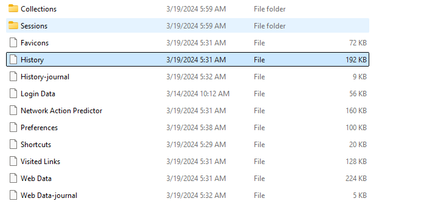

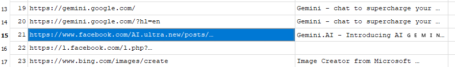

And we found it:

`Gemini.AI - Introducing AI 🇬 🇪 🇲 🇮 🇳 🇮 special version for... | Facebook`

Looks like a fake Gemini AI version being advertised as a legitimate Google AI tool.

# Task 2

`Can you confirm the timestamp in UTC when Alonzo visited this post?`

In the same table, we can find the `WebKit timestamp`, which uses the Windows 1601 epoch as its starting point and stores the timestamp as a 64-bit integer representing microseconds.

`13355296200136503` in UTC = `2024-03-19 04:30:00`

# Task 3

`Alonzo downloaded a file on the system thinking it was an AI Assistant tool. What is name of the archive file downloaded?`

Still working with `DB Browser`, we can use the `downloads` table.

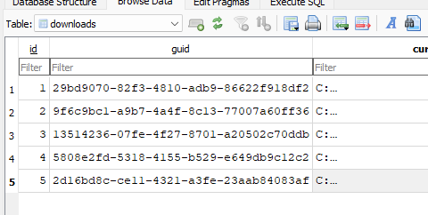

And with a size of `40k bytes`:

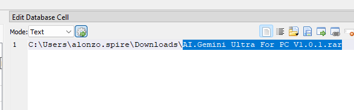

# Task 4

`What was the full direct url from where the file was downloaded?`

For that, and using the download ID `5`, we can inspect the `downloads_url_chains` table to find the URLs involved in the download.

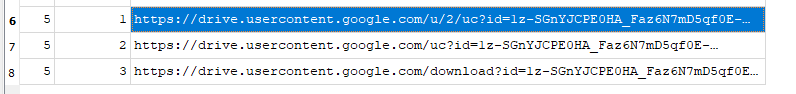

We can also find more evidence in the `downloads` table by looking at the `referrer` column.

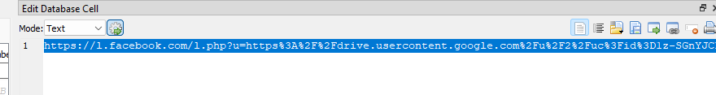

We can see that the `.php` file that was visited is an endpoint that takes a URL as a parameter and redirects the user to it. This is a link-wrapper URL: it does not point directly to the final destination, but instead points to an intermediate endpoint that redirects the user.

# Task 5

`Alonzo then proceeded to install the newly downloaded app, thinking that it was a legitimate AI tool. What is the true product version that was installed?`

We pivot into parsing the Windows logs and inspecting them with `Timeline Explorer`.

Trying to look for process creation:

```powershell
./EvtxECmd.exe -f "C:\Users\analyst\Sherlocks\DetroitBecomeHuman\Triage\C\Windows\System32\winevt\logs\Security.evtx" --csv "C:\Users\analyst\Sherlocks\DetroitBecomeHuman\ParsedLogs\"
```

Using Zimmerman's tools to parse the logs:

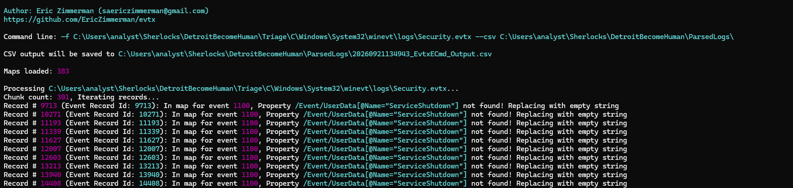

We found no relevant data.

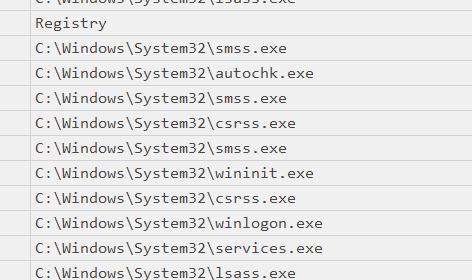

For Event ID `4688`:

We also inspect the registry hive of the user in question:

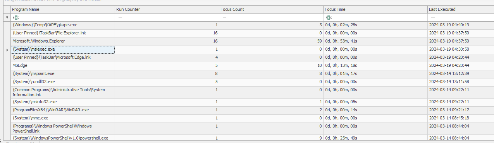

We found that the Windows Installer engine ran seconds after the download.

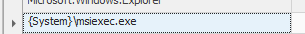

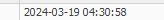

Following this finding, we can check whether we have a prefetch file for `msiexec.exe` in the provided triage artifacts.

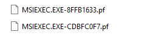

We run it through `PECmd`:

```powershell
.\PECmd.exe -f "C:\Users\analyst\Sherlocks\DetroitBecomeHuman\Triage\C\Windows\Prefetch\MSIEXEC.EXE-8FFB1633.pf"
```

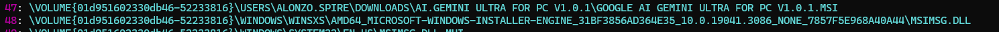

We found the AI Gemini reference.

Going back to Alonzo's registry hive and checking the installer path, we find an entry for an MSI product.

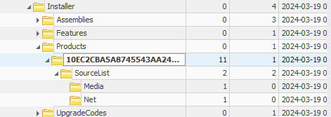

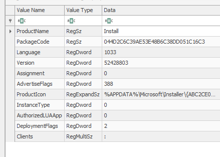

Inside its source list:

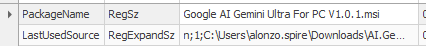

We find our malicious target.

So we take the MSI version, which is packed as a 32-bit integer:

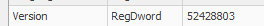

And we convert it according to the documented MSI version format:

```powershell
[uint32]$v = 52428803
"Major: $($v -shr 24)"
"Minor: $(($v -shr 16) -band 0xFF)"
"Build: $($v -band 0xFFFF)"
```

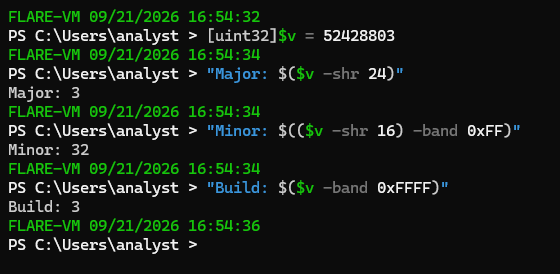

We get `3.32.3`.

# Task 6

`When was the malicious product/package successfully installed on the system?`

For this task, we move into inspecting the `Application.evtx` log we were provided.

We first parse it with `EvtxECmd`:

```powershell
./EvtxECmd.exe -f "C:\Users\analyst\Sherlocks\DetroitBecomeHuman\Triage\C\Windows\System32\winevt\logs\Application.evtx" --csv "C:\Users\analyst\Sherlocks\DetroitBecomeHuman\ParsedLogs\"
```

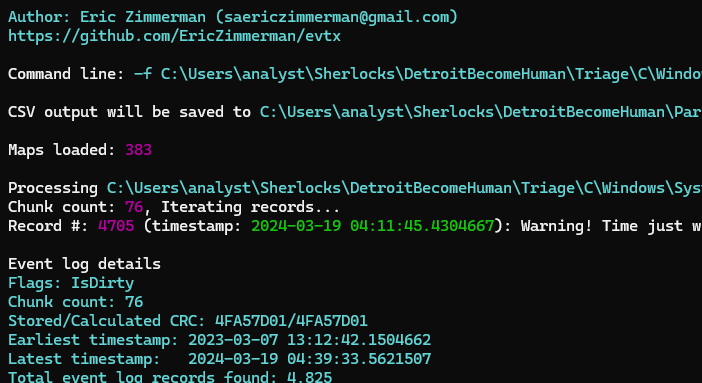

We then open the `.csv` with `Timeline Explorer` and search for the provider `MsiInstaller`.

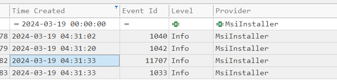

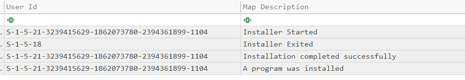

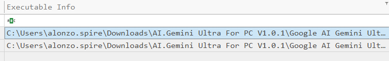

All the relevant data correlates with the initial malware installation.

# Task 7

`The malware used a legitimate location to stage its file on the endpoint. Can you find out the Directory path of this location?`

We can use all the information we have gathered so far to search for relevant information in the `$MFT` record we were provided.

We parse it using `MFTECmd`:

```powershell
.\MFTECmd.exe -f "C:\Users\analyst\Sherlocks\DetroitBecomeHuman\Triage\C\`$MFT" --csv "C:\Users\analyst\Sherlocks\DetroitBecomeHuman\ParsedLogs\"
```

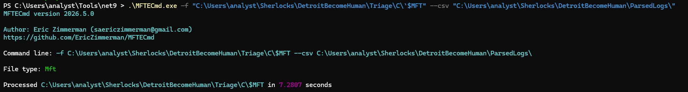

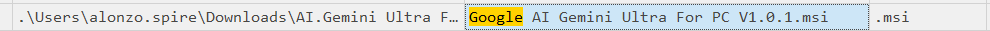

Since we suspect that files were created during the installation process, we look for the Windows Installer registration GUID that we already found in the registry hive.

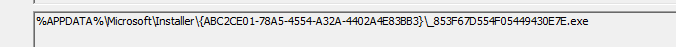

`ABC2CE01-78A5-4554-A32A-4402A4E83BB3`

Correlating the findings:

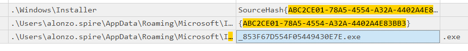

The `.exe`:

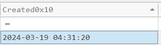

So this `.exe` was created 22 seconds after `msiexec.exe` executed.

Inspecting the MFT further:

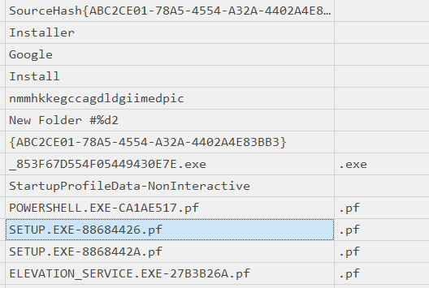

We find interesting prefetch files appearing around the same time.

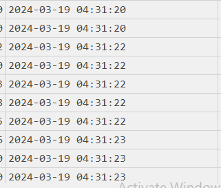

We then proceed to parse the prefetch files using `PECmd.exe`:

```powershell
.\PECmd.exe -f "C:\Users\analyst\Sherlocks\DetroitBecomeHuman\Triage\C\Windows\Prefetch\POWERSHELL.EXE-CA1AE517.pf"
```

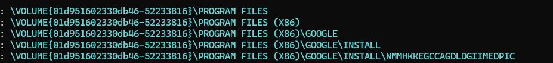

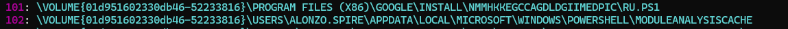

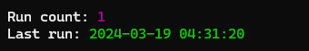

And this makes sense since the malware is impersonating a Google Gemini application.

# Task 8

`The malware executed a command from a file. What is name of this file?`

In the Windows PowerShell logs, we find:

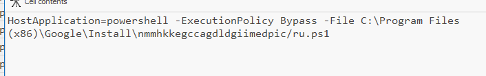

In the `$MFT`, we find interesting files under the staging folder.

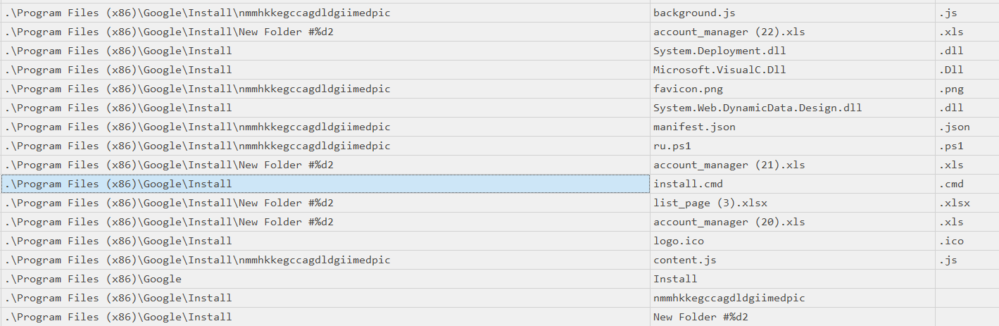

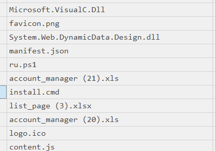

For this task, one file that stands out is `install.cmd`.

We know that in our prefetch files we have:

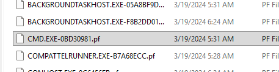

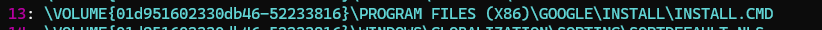

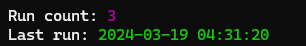

So far, it seems that `install.cmd` triggers the execution of `ru.ps1`.

Based on the timestamps:

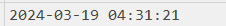

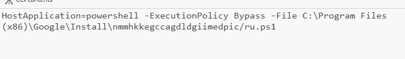

One second before this PowerShell execution, we see the `install.cmd` file.

Since we have metadata for `install.cmd` in the `$MFT`, we can try to dump it, as NTFS sometimes stores the actual file content inside the MFT record itself as **resident data**.

Dumping the MFT:

```powershell
.\MFTECmd.exe -f "C:\Users\analyst\Sherlocks\DetroitBecomeHuman\Triage\C\`$MFT" --csv "C:\Users\analyst\Sherlocks\DetroitBecomeHuman\DumpMFT" --dr
```

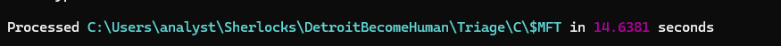

Then, in the folder called `Resident`:

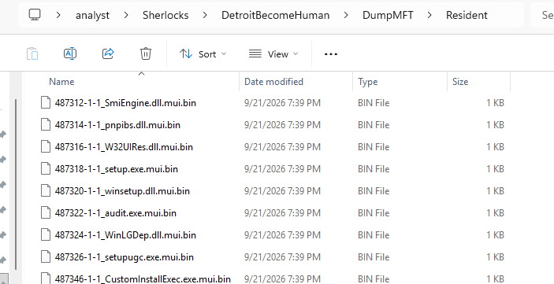

We get the contents of `install.cmd`.

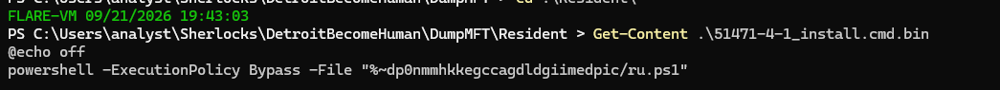

# Task 9

`What are the contents of the file from question 8? Remove whitespace to avoid format issues.`

This was solved during Task 8, since we needed to confirm the contents before we could confidently assume that `install.cmd` was the file in question.


# Task 10

`What was the command executed from this file according to the logs?`

We find this in the Windows PowerShell `.evtx` logs.

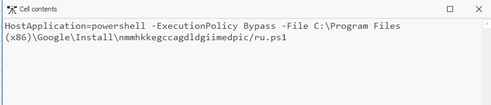

# Task 11

`Under malware staging Directory, a js file resides which is very small in size. What is the hex offset for this file on the filesystem?`

Going back to our `$MFT` results:

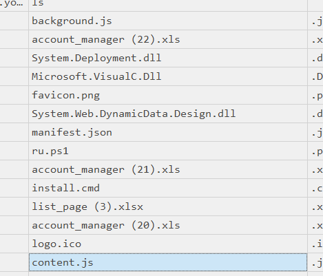

We see two `.js` files under the staging folder, but `content.js` has the smallest size.

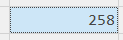

Entry number:

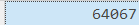

The hex offset for an MFT record is calculated by multiplying its entry number by `1024`, since each MFT record is exactly 1024 bytes.

```text
Entry Number × 1024 = Byte Offset
```

```text
51471 × 1024 = 52,706,304 bytes
52,706,304 in hex = 0x3243000
```

`0x3E90C00`

`3E90C00`

# Task 12

`Recover the contents of this js file so we can forward this to our RE/MA team for further analysis and understanding of this infection chain. To sanitize the payload, remove whitespaces.`

Since we already have the entry number, we can dump the contents associated with it:

```powershell
.\MFTECmd.exe -f "C:\Users\analyst\Sherlocks\DetroitBecomeHuman\Triage\C\`$MFT" --de 64067
```

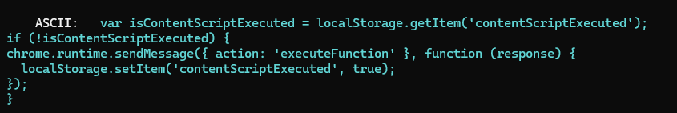

# Task 13

`Upon seeing no AI Assistant app being run, Alonzo tried searching for it from File Explorer. What keywords did he use to search?`

One of the most relevant artifacts is the Windows Explorer `WordWheelQuery` registry key. It records search terms entered by the user through Explorer.

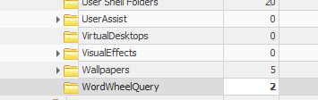

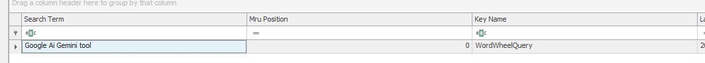

# Task 14

`When did Alonzo search for it?`

In the same table, we find:


# Task 15

`After Alonzo could not find any AI tool on the system, he became suspicious, contacted the security team, and deleted the downloaded file. When was the file deleted by Alonzo?`

For deleted artifacts, we have access to `$Recycle.Bin`.


So we find two `.rar` files. This makes it likely that one of them is the original `.rar` that was downloaded.

What's important is that `$R` contains the actual deleted file, while `$I` contains metadata about the deletion.

```powershell
Format-Hex -Path 'C:\Users\analyst\Sherlocks\DetroitBecomeHuman\Triage\C\$Recycle.Bin\S-1-5-21-3239415629-1862073780-2394361899-1104\$I2MU60B.rar'
```


We confirm the `.rar` is related to the fake Gemini, and at offset `0x10` we can see the deletion timestamp stored in 8 bytes:

```text
10 5C C4 B3 B6 79 DA 01
```

Windows `FILETIME` values are stored in little-endian format, so we read the bytes in reverse order:

```text
Bytes on disk:  10 5C C4 B3 B6 79 DA 01
Reversed:       01 DA 79 B6 B3 C4 5C 10
Hex value:      0x01DA79B6B3C45C10
```

Convert to decimal:

```text
0x01DA79B6B3C45C10 = 133,542,663,132,450,832
```

That's a `FILETIME` value, representing 100-nanosecond intervals since `1601-01-01`. We convert it to Unix time:

```text
Unix seconds = (FILETIME / 10,000,000) − 11,644,473,600
             = (133,542,663,132,450,832 / 10,000,000) − 11,644,473,600
             = 13,354,266,313.245 − 11,644,473,600
             = 1,709,792,713.245
```

`2024-03-09 05:58:33 UTC`

# Task 16

`Looking back at the starting point of this infection, please find the md5 hash of the malicious installer.`

Since we have the `.rar`, we can also try to dump it and extract its contents.

When trying to extract it, we see that it is password protected:

```powershell
7z x "C:\Users\analyst\Sherlocks\DetroitBecomeHuman\`$R2MU60B.rar" -o"C:\Users\analyst\Sherlocks\DetroitBecomeHuman\extracted2"
```


But it also reveals the name of the file:

