# Sherlock Scenario

> You’re a third-party IR consultant and your manager has just forwarded you a case from a small-sized startup named cloud-guru-management ltd. They’re currently building out a product with their team of developers, but the CEO has received word-of-mouth communications that their Intellectual Property has been stolen and is in use elsewhere.

> The user in question says she may have accidentally shared her Documents folder and has stated that she thinks the attack happened on the 6th of October. The user also states she was away from her computer on this day.

> There is not a great deal more information from the company besides this. An investigation was initiated into the root cause of this potential theft from Cloud-guru; however, the team has failed to discover the cause of the leak. They have gathered some preliminary evidence for you via a KAPE triage. It’s up to you to discover the story of how this all came to be. **Warning:** This Sherlock requires an element of OSINT, and players will need to interact with third-party services on the internet.

We are given a KAPE Live Response collection/parsed artifacts.

And a collected filesystem from the suspected machine.

# Task 1

`Which folders were shared on the host? (Please give your answer comma separated, like this: c:\program files\share1, D:\folder\share2)`

This task is suggesting that some folders were exposed as network shares (SMB).

Windows stores information about shared folders, also known as SMB shares, in this Registry Key:

`HKLM\SYSTEM\CurrentControlSet\Services\LanmanServer\Shares`

We target the `regdump.csv` we got.

```powershell
Select-String -Path 'C:\Users\analyst\Sherlocks\Jinkies_KAPE_output\LiveResponse\LiveResponse\CrowdResponse_regdump.csv' -Pattern 'LanmanServer' -CaseSensitive:$false
```


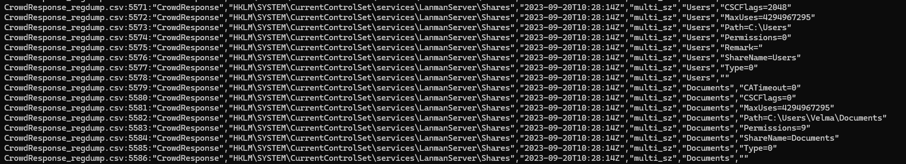

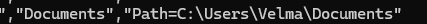


We find with this search all the shares under the `LanmanServer` service, which is responsible for providing the Windows file-sharing functionality.

# Task 2

`What was the file that gave the attacker access to the user's account?`

## Inspecting suspicious .py login files in NTFS

Before searching randomly, we want to determine what kind of access the attacker obtained.

So we start by searching what is actually inside the `Velma` folder:

```powershell
Get-ChildItem 'C:\Users\analyst\Sherlocks\Jinkies_KAPE_output\TriageData\C\Users\Velma' -Force |
    Select-Object Name,Length,LastWriteTime,Attributes
```

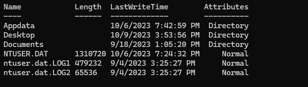

We can also just use regular Explorer to find and understand its contents.

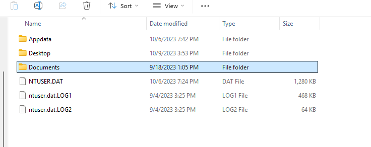

The first thing we cannot fully assume, but can work with, is the timeline. Since the attack seems to have happened on the 6th of October, we can start our search with the `AppData` folder.

We then run a full scan on Velma's directory to see which files had activity closest to the suspected compromise:

```powershell
$base = 'C:\Users\analyst\Sherlocks\Jinkies_KAPE_output\TriageData\C\Users\Velma'

Get-ChildItem $base -Force -File -Recurse -ErrorAction SilentlyContinue |
    Select-Object FullName,Length,CreationTime,LastWriteTime |
    Sort-Object LastWriteTime -Descending |
    Select-Object -First 100 |
    Format-Table -AutoSize
```

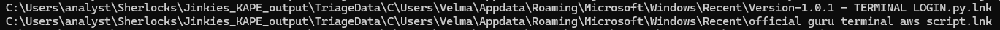

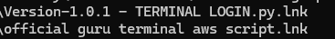

These names are interesting since they heavily suggest a terminal login.

We are dealing with `.lnk` files, which are Windows shortcuts pointing to another file or executable.

This can preserve useful information and metadata, so we use `LECmd` to properly parse them:

```powershell
./LECmd.exe -d "C:\Users\analyst\Sherlocks\Jinkies_KAPE_output\TriageData\C\Users\Velma\Appdata\Roaming\Microsoft\Windows\Recent" --csv "C:\Temp\LECmd"
```

We use `Timeline Explorer` to inspect the `.csv` output.

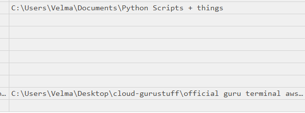

We find the location of the `.py` file.

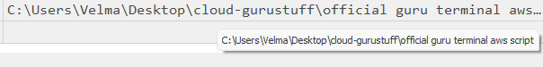

The problem is that the file does not exist in our KAPE image.

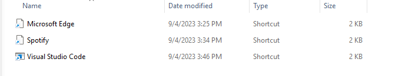

So far, we know `TERMINAL LOGIN.py` existed and was accessed on October 6th.

We can start looking at the USN Journal and NTFS metadata for the suspected changes.

Running:

```powershell
Get-ChildItem 'C:\Users\analyst\Sherlocks\Jinkies_KAPE_output\TriageData\C' -Force -Recurse -ErrorAction SilentlyContinue |
    Where-Object {
        $_.Name -like '$*' -or
        $_.FullName -match '\\\$Extend\\'
    } |
    Select-Object FullName, Length, LastWriteTime
```

We can list all the `$` files we have.

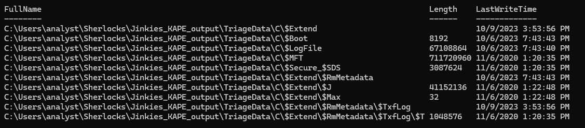

`$MFT` is the highest priority since it can retain metadata for files that are no longer present in the live filesystem.

```powershell
New-Item -ItemType Directory -Force 'C:\Users\analyst\Sherlocks\Jinkies_Work' | Out-Null

MFTECmd.exe -f 'C:\Users\analyst\Sherlocks\Jinkies_KAPE_output\TriageData\C\$MFT' `
    --csv 'C:\Users\analyst\Sherlocks\Jinkies_Work\MFT'
```

We use `MFTECmd` to parse the file and output the results into a `.csv`.

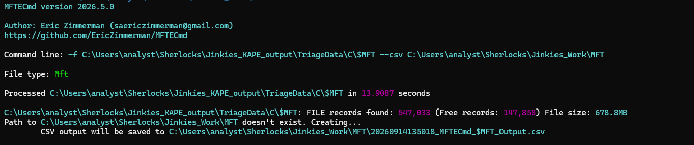

Then we do a specific search over the `.csv` with keywords to look for the terminal login:

```powershell
Import-Csv 'C:\Users\analyst\Sherlocks\Jinkies_Work\MFT\20260914135018_MFTECmd_$MFT_Output.csv' |
    Where-Object {
        $_.FileName -like '*TERMINAL LOGIN*' -or
        $_.FileName -like '*guru terminal aws*'
    } |
    Select-Object EntryNumber,SequenceNumber,ParentEntryNumber,FileName,InUse,Deleted,
    Created0x10,Created0x30,LastModified0x10,LastModified0x30,
    LastAccess0x10,LastAccess0x30 |
    Format-List
```

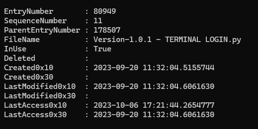

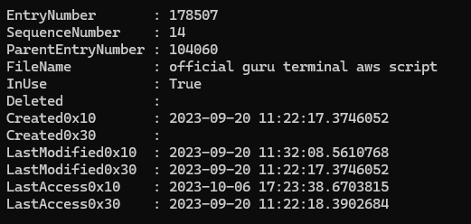

So NTFS confirms the structure:

```text
official guru terminal aws script
Version-1.0.1 - TERMINAL LOGIN.py
```

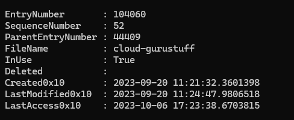

After attempting many `$MFT` searches, we come to the conclusion that we cannot inspect the contents of these files, so we pivot to another finding.

## Pivoting to credential-related contents

We pivot into searching the actual collected files for credential-related content.

```powershell
Get-ChildItem `
    'C:\Users\analyst\Sherlocks\Jinkies_KAPE_output\TriageData\C\Users\Velma' `
    -Recurse -Force -File -ErrorAction SilentlyContinue |
Where-Object {
    $_.Name -match '(?i)(cred|credential|password|passwd|login|account|secret|users|user|auth|token|key|aws)'
} |
Select-Object FullName,Length,CreationTime,LastWriteTime,LastAccessTime |
Sort-Object FullName
```

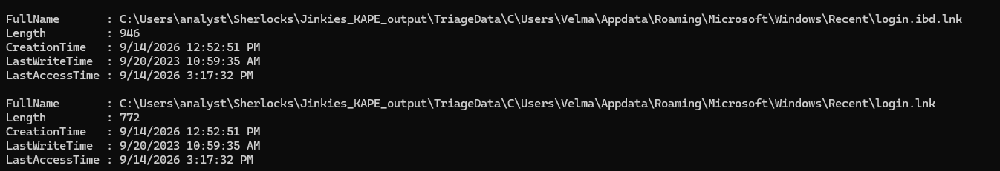

We find two interesting `.ibd` files, which are InnoDB data files. In an InnoDB database, an `.ibd` file can contain the data and indexes for an individual table when file-per-table is enabled.

But again, this shows us a `.lnk` file, so we do a proper search of the KAPE image files for specific database file extensions:

```powershell
Get-ChildItem `
    'C:\Users\analyst\Sherlocks\Jinkies_KAPE_output\TriageData\C\Users\Velma' `
    -Recurse -Force -File -ErrorAction SilentlyContinue |
Where-Object {
    $_.Name -match '(?i)\.(ibd|frm|sql|db|sqlite|sqlite3)$' -or
    $_.FullName -match '(?i)\\mysql\\'
} |
Select-Object FullName,Length,LastWriteTime |
Sort-Object FullName
```

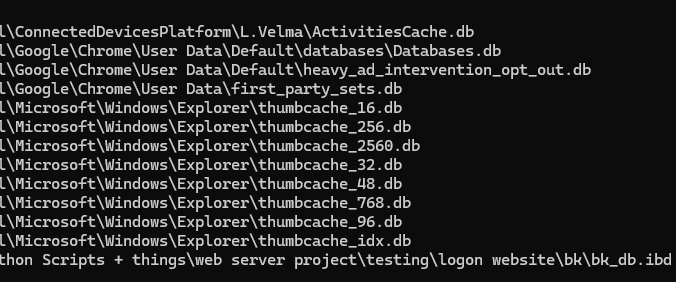

We finally find a concrete database artifact under the name `logon website`.

So we proceed to run the `strings` function against the `.ibd` file to see what we can extract.

We create a variable to make it easier to work with:

```powershell
$ibd = 'C:\Users\analyst\Sherlocks\Jinkies_KAPE_output\TriageData\C\Users\Velma\Documents\Python Scripts + things\web server project\testing\logon website\bk\bk_db.ibd'
```

Then run `strings` on it:

```powershell
strings.exe -n 4 $ibd
```

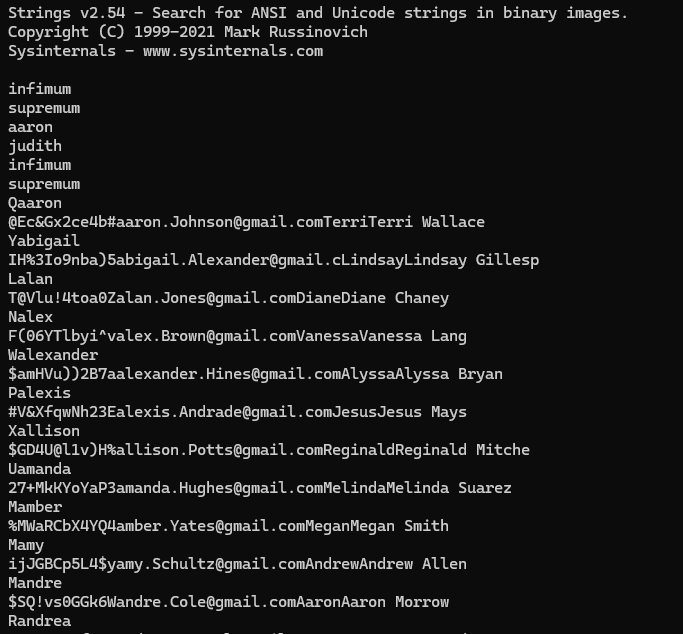

# Task 3

`How many user credentials were found in the file?`

Since we already have the file, we can use a simple PowerShell pipeline to extract the relevant information:

```powershell
strings.exe -n 4 $ibd |
    Select-String -Pattern '[A-Za-z0-9._%+-]+@[A-Za-z0-9.-]+\.[A-Za-z]{2,}' |
    ForEach-Object { $_.Matches.Value } |
    Sort-Object -Unique |
    Measure-Object
```

# Task 4

`What is the NT hash of the user's password?`

An NT hash is the hash of a Windows account password stored in the SAM database. The hash itself is not stored in plaintext.

So we check for the relevant hives:

```powershell
Get-ChildItem 'C:\Users\analyst\Sherlocks\Jinkies_KAPE_output\TriageData\C\Windows\System32\config' |
    Where-Object Name -in 'SAM','SYSTEM','SECURITY' |
    Select Name,Length,LastWriteTime
```

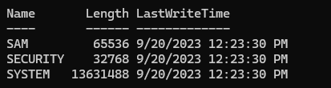

Since we have access to the `SYSTEM` hive, we can use Impacket's `secretsdump` functionality to handle the required key derivation and decryption process for the SAM hashes.

We cannot find this hash using `Registry Explorer` because the relevant SAM data is protected and requires the system boot key to decrypt.

Since Impacket is usually used for remote dumping over SMB, we call the underlying classes directly for our local case:

```powershell
py -3 -c "from impacket.examples.secretsdump import LocalOperations,SAMHashes; sam=r'C:\Users\analyst\Sherlocks\Jinkies_KAPE_output\TriageData\C\Windows\System32\config\SAM'; sys=r'C:\Users\analyst\Sherlocks\Jinkies_KAPE_output\TriageData\C\Windows\System32\config\SYSTEM'; op=LocalOperations(sys); boot=op.getBootKey(); h=SAMHashes(sam,bootKey=boot,perSecretCallback=lambda x: print(x)); h.dump(); h.finish()"
```

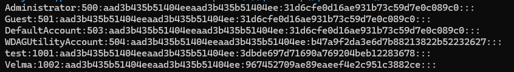

# Task 5

We already found the user's credentials in the database file.

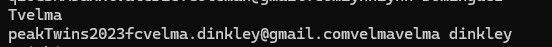

So we use an online tool to hash the password.

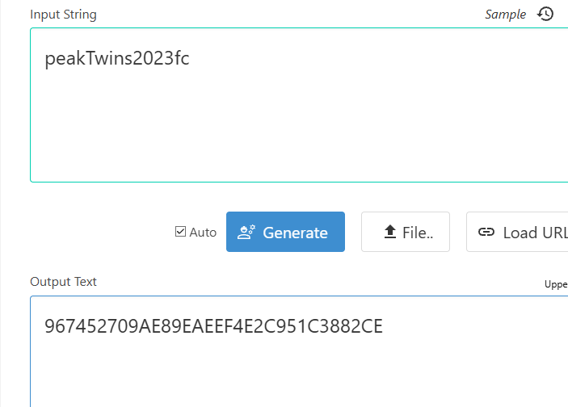

Then we compare it with the hash we found previously, and it matches.

# Task 6

`What was the time the attacker first interactively logged on to our user's host?`

For that, the best artifacts to inspect are the Windows Security Event Logs.

`Event ID 4624` records successful logons, and `Logon Type 2` corresponds to an interactive logon.

We first use `EvtxECmd` to parse the logs into a `.csv` that we can later explore with `Timeline Explorer`:

```powershell
./EvtxECmd.exe -f "C:\Users\analyst\Sherlocks\Jinkies_KAPE_output\TriageData\C\Windows\System32\winevt\Logs\Security.evtx" --csv "C:\Users\analyst\Desktop\SecurityParsed"
```

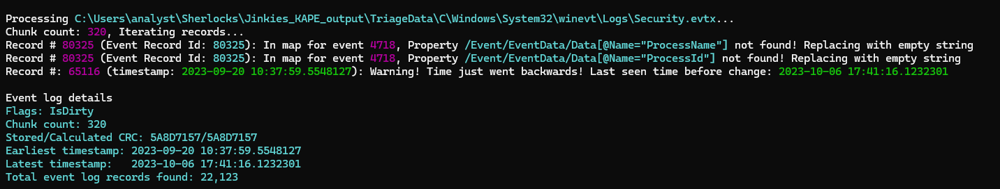

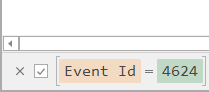

We find this unique remote IP.

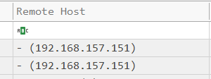

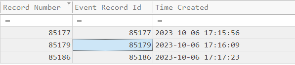

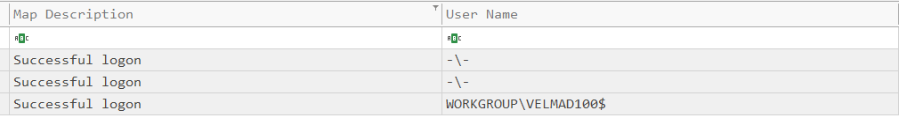

So it's the third one that actually logs into the host `WORKGROUP/VELMAD100$`.

# Task 7

`What's the first command the attacker issues into the Command Line?`

For this, we want to parse all the logs through `EvtxECmd` to extract and find the command-line arguments used, giving us a better idea of the execution timeline.

```powershell
.\EvtxECmd.exe -d "C:\Users\analyst\Sherlocks\Jinkies_KAPE_output\TriageData\C\Windows\System32\winevt\Logs" --csv "C:\Users\analyst\Sherlocks\Jinkies_KAPE_output" --csvf "evtxecmd-out"
```

That will convert all `.evtx` logs into `.csv` files that we can then inspect with `Timeline Explorer`.

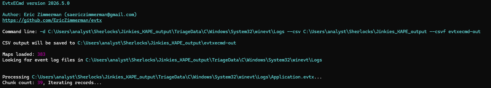

In Timeline Explorer, we do a search for `cmd.exe` based on the task requirements.

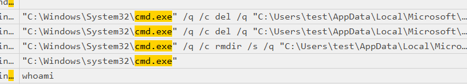

We found the first suspect, a very common command as soon as an attacker gets a foothold: `whoami`.

We check the timestamps.

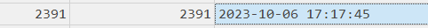

It fits perfectly with the narrative of connecting at `:23s` and using the first basic reconnaissance command at `:45s`.

# Task 8

`What is the name of the file that the attacker opens in VSCode shortly before launching the web browser?`

Using the same `Timeline Explorer` instance, we now search for `code.exe` to see all events related to VS Code.

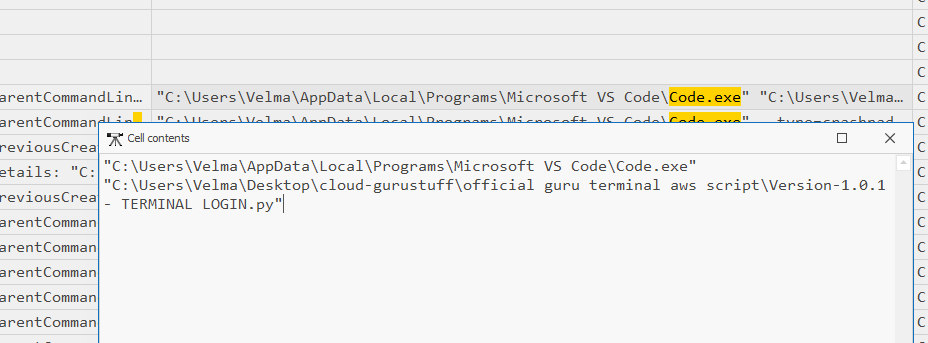

And we find the file we were already suspecting since Task 1.

# Task 9

`What's the domain name of the location the attacker likely exfiltrated the file to?`

From the previous investigation under `code.exe`, we also find a large chain of events that the `Terminal LOGIN.py` triggered through `code.exe`, as we can see in the `ParentCommandLine` field:

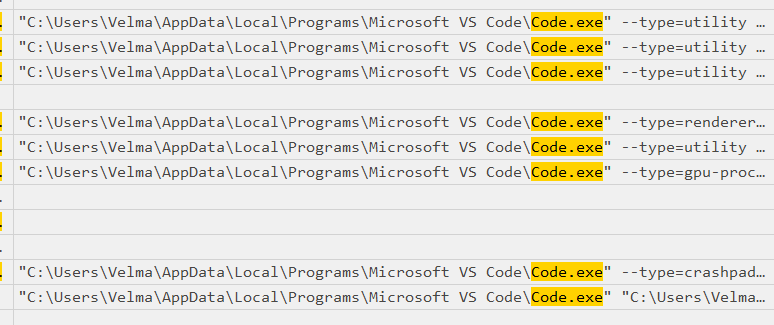

These events all share the same parent:

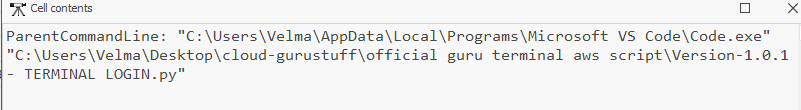

Including:

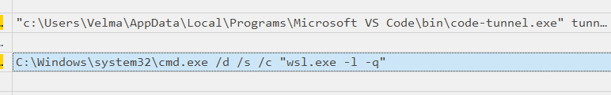

Further inspecting the behavior of `code.exe`:

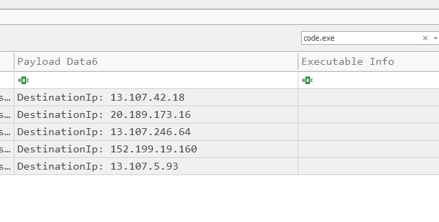

We see the external IPs it contacted.

Inspecting the `Event ID 3` events further, we find:

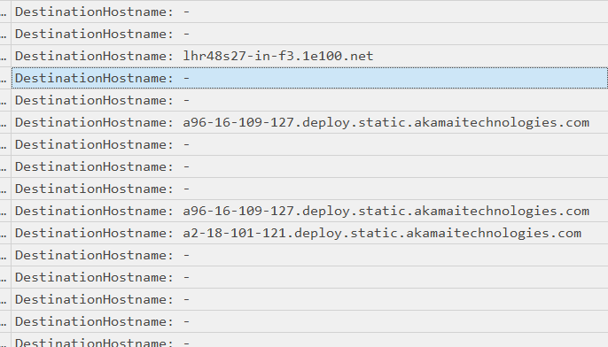

Different domains contacted, including Google and Akamai.

We also find:

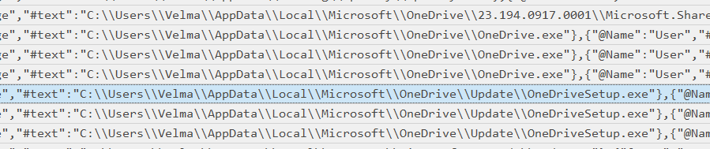

The use of a cloud storage service, which could potentially be used for exfiltration.

It is also important to understand that, based on the Sherlock scenario, the legitimate user was away from the computer. Therefore, all actions on that day originating from `EXPLORER.exe` should be treated as being performed by the attacker.

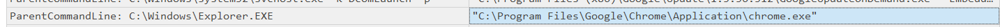

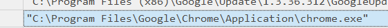

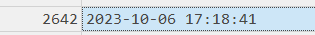

Such as this, which we find immediately after the trigger of the `.py` script.

Weirdly, we find not a single `Event ID 3` generated by `chrome`.

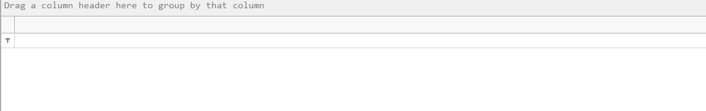

This raises the alarms and makes me wonder if there is some `msaRAT`-style attack.

So, since we had access to the history database in `AppData`, we use `DB Browser` to inspect it.

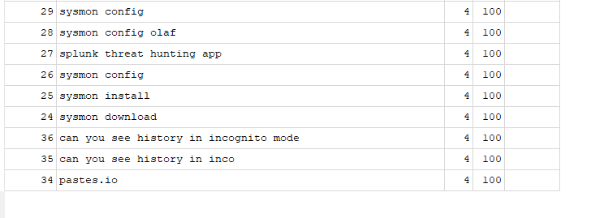

We also find a `.txt` file created.

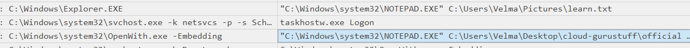

`Pastes.io` is a paste site used to store and share plain text, similar to Pastebin.

# Task 10

`What is the handle of the attacker?`

We keep investigating the `learn.txt` file, which we cannot find in our files, but we search through the `$MFT`.

```powershell
.\MFTECmd.exe -f "C:\Users\analyst\Sherlocks\Jinkies_KAPE_output\TriageData\C\`$MFT" --csv "C:\Users\analyst\Sherlocks\Jinkies_KAPE_output" --csvf "mft"
```

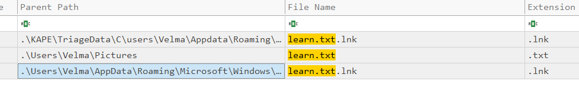

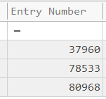

We then use the entry number of the file from the images we have to dump all the metadata:

```powershell
.\MFTECmd.exe -f "C:\Users\analyst\Sherlocks\Jinkies_KAPE_output\TriageData\C\$MFT" --de 78533
```

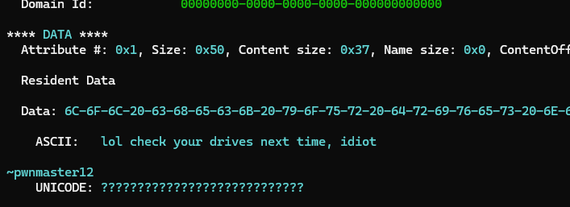

Finally, we find the attacker's handle: `pwnmaster12`.