# Sherlock Scenario

> You have been presented with the opportunity to work as a junior DFIR consultant for a big consultancy. However, they have provided a technical assessment for you to complete. The consultancy Forela-Security would like to gauge your knowledge of Windows Event Log Analysis. Please analyze and report back on the questions they have asked.

We are given 5 files `.evtx`, which are the Windows XML Event Log format.

# Task 1

> When did the cyberjunkie user first successfully log into his computer? (UTC)

Since we are looking for logins, we inspect `Security.evtx`.

We look for Event ID `4624`.

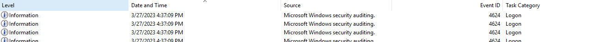

Then we can use the find function to search for the specific username and first order the events by time.

We find the first occurrence:

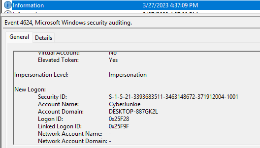

The important thing here is that we are being asked about the UTC time. Machines can have different time zones, so what we do is inspect the event and look for the `SystemTime`, since it's a standardized log that can be correlated across systems globally regardless of local time settings.

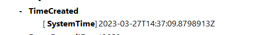

We find the 2 hour discrepancy.

# Task 2

> The user tampered with firewall settings on the system. Analyze the firewall event logs to find out the Name of the firewall rule added?

For this task, we need to switch the event log to `Windows Firewall-Firewall.evtx`.

An important detail from the previous task is that we get to see the Account Domain that is being used by CyberJunkie:

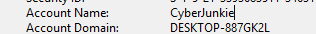

After inspecting for Event ID `2004`, corresponding to a rule being added to Windows Firewall:

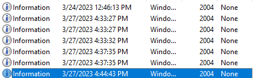

We eventually find a suspicious rule name:

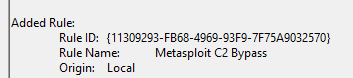

# Task 3

> Whats the direction of the firewall rule?

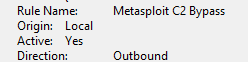

In the same log, we can see it's `Outbound`.

This means that the rule cares about traffic that originates from inside the machine. So this paints a clear picture that this is about establishing a C2 channel.

# Task 4

> The user changed audit policy of the computer. Whats the Subcategory of this changed policy?

To find the logs about Audit Policy changes, we need to go back to `Security.evtx` and search for Event ID `4719`.

Audit policies are used to decide what types of actions get recorded in the Event Viewer, so this could be a target of an attacker.

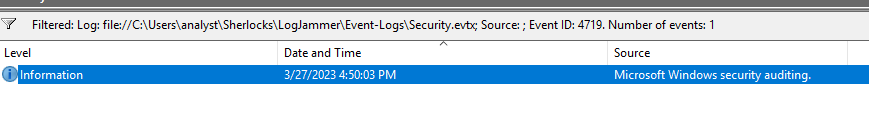

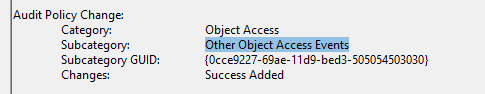

After investigation, we find that **Other Object Access Events** tracks files, scheduled tasks, registry keys, etc.

Some scripts turn this on and then create a new scheduled task, and they need this audit enabled to get back a confirmation of the success of the task creation.

That is why it can be misleading when trying to determine the intent behind the audit policy change.

# Task 5

> The user "cyberjunkie" created a scheduled task. Whats the name of this task?

Still on `Security.evtx`, we look for Event ID `4698`.

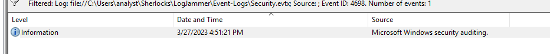

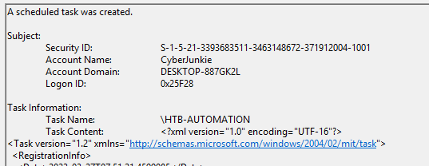

As the previous investigation pointed us towards, now we see how the attacker created a scheduled task.

# Task 6

> Whats the full path of the file which was scheduled for the task?

Inspecting further into the event details:

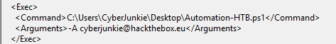

We find an email and a `.ps1` PowerShell script.

# Task 7

> What are the arguments of the command?

# Task 8

> The antivirus running on the system identified a threat and performed actions on it. Which tool was identified as malware by antivirus?

For this task, we need to switch to the log `Windows Defender-Operational.evtx` to search for antivirus-related events.

Then we search for Event ID `1116`, corresponding to Antivirus detecting malware or potentially unwanted software.

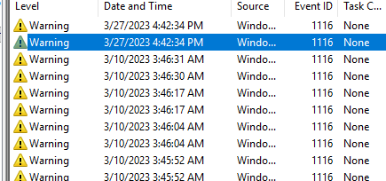

After performing the search, all events are related to `SharpHound` and `Meterpreter`.

`SharpHound` is known as an Active Directory data collection and reconnaissance tool.

`Meterpreter` is a C2 shell that is part of the Metasploit Framework.

# Task 9

> Whats the full path of the malware which raised the alert?

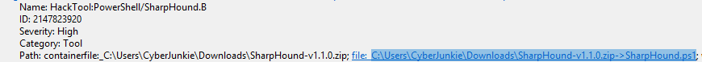

In the event details, we find it.

# Task 10

> What action was taken by the antivirus?

We need to change the Event ID search to `1117`.

`1116` -> Threat detected

`1117` -> Action taken

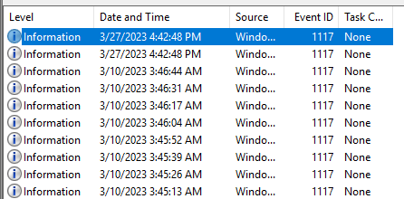

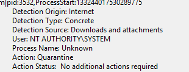

And in the details, we can see the action.

# Task 11

> The user used Powershell to execute commands. What command was executed by the user?

We have to look at the `Powershell-Operational.evtx` logs.

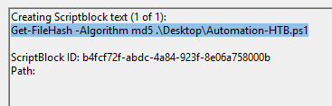

We find a command pointing to the previous PowerShell script we found. In this case, it is calculating the MD5 hash of the script.

# Task 12

> We suspect the user deleted some event logs. Which Event log file was cleared?

We go and check the `Security.evtx` logs and look for Event ID `1102`, corresponding to a log being cleared/deleted.

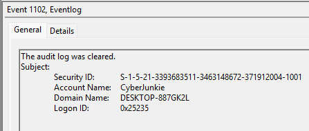

We found one instance that happened by the suspected user.

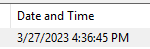

Then we pivot towards `System.evtx` to find the actual name of the log that was cleared, and search for Event ID `104`.

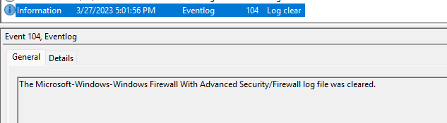

And we find it.

