# Recollection Sherlock

## Sherlock Scenario

> A junior member of our security team has been performing research and testing on what we believe to be an old and insecure operating system. We believe it may have been compromised & have managed to retrieve a memory dump of the asset. We want to confirm what actions were carried out by the attacker and if any other assets in our environment might be affected. Please answer the questions below.

We are given a single `.bin` file.

In this scenario we have to install and build Python 2.7 and Volatility2 we gonna do it in a way we keep Python 3 and Volatility3 separated from each other. So in the future we can always choose what tool we use.

# Task 1

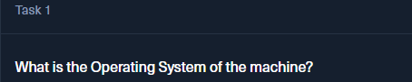

We used the Volatility tool on the `.bin` file.

```powershell
C:\Python313\Scripts\vol.exe -f recollection.bin windows.info
```

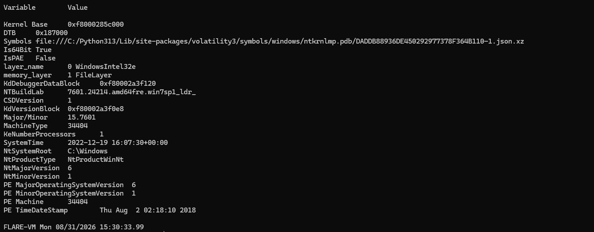

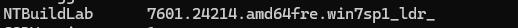

We find it's a Windows 7 system.

# Task 2


In the same output, we see:

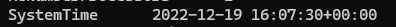

# Task 3

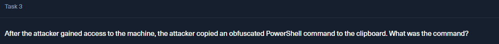

For this task, we need to use Volatility 2 since it has a plugin that can read the contents of the clipboard.

We had to install a separate Python 2.7 and Volatility 2.

Then we ran:

```powershell
C:\Python27\python.exe .\vol.py -f C:\Users\analyst\Sherlocks\Recollection\recollection.bin --profile=Win7SP1x64 clipboard
```

Here we specifically use the Python 2 version, and we run it from the Volatility 2 folder so we can just call `vol.py`.

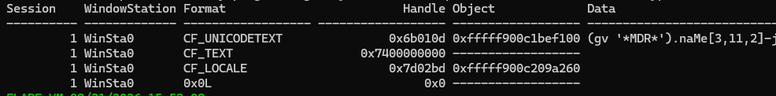

Obfuscated command:

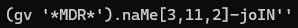

# Task 4

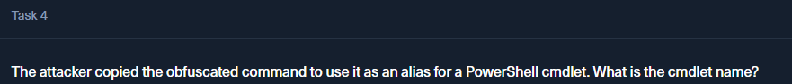

For this task, we lack more information to deobfuscate what the cmdlet is doing. We just note that `gv` is the alias for `Get-Variable`.

First, we list all the processes running when the dump was taken:

```powershell
C:\Python27\python.exe .\vol.py -f C:\Users\analyst\Sherlocks\Recollection\recollection.bin --profile=Win7SP1x64 pslist
```

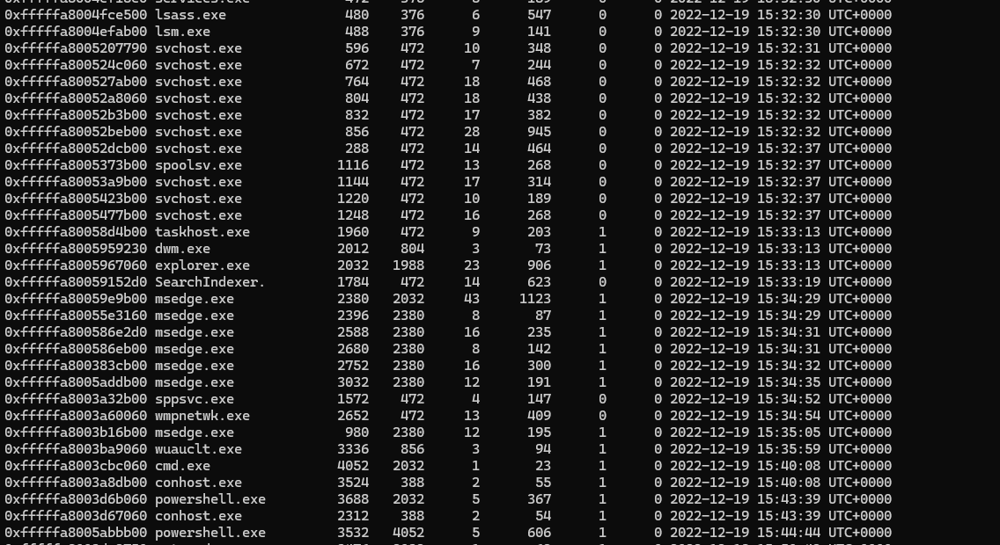

We actually see 2 instances of `powershell.exe`, and by inspecting the Parent PID, we can see that the second one, PID `3532`, was actually started by `cmd.exe`. So we investigate that one:

```powershell
C:\Python27\python.exe .\vol.py -f C:\Users\analyst\Sherlocks\Recollection\recollection.bin --profile=Win7SP1x64 consoles
```

We land a big hit:

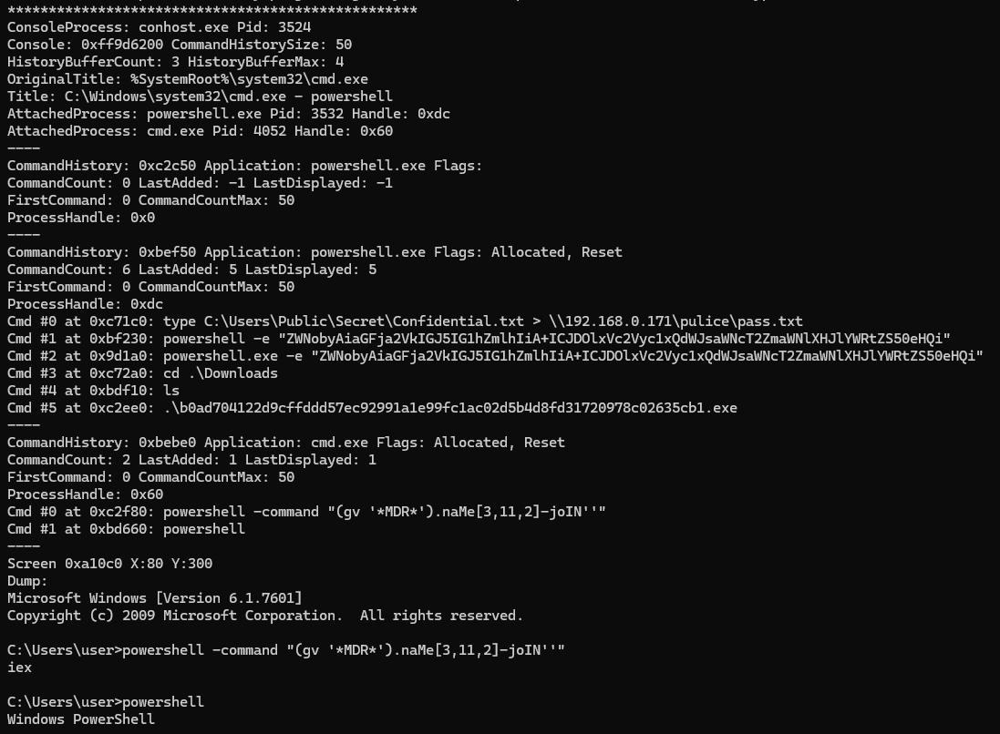

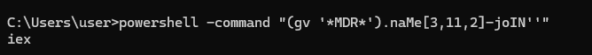

We see the attacker checking their obfuscated string, with the result being `iex`.

`Invoke-Expression`

`Invoke-Expression` is a PowerShell cmdlet that evaluates or runs a specified string as a command. It allows you to execute commands stored in variables or strings, returning the results of those commands.

# Task 5

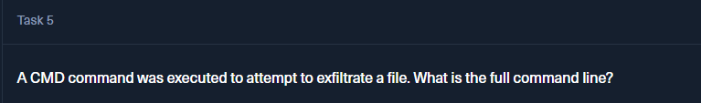

In the same output, we can see the usage of the `type` command.

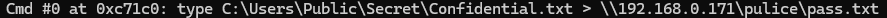

We can see that we call `type` to read the contents and redirect the output using `>` to another IP.

# Task 6


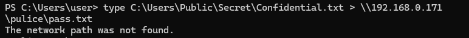

We see how it failed on the exfiltration attempt.

# Task 7

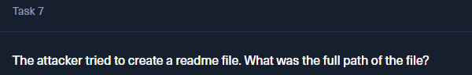

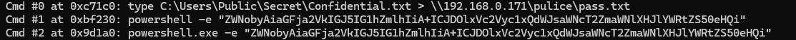

In the same output, we find this weird string after the `-e` flag, which tells us this is a Base64 encoded string, so we decode it:

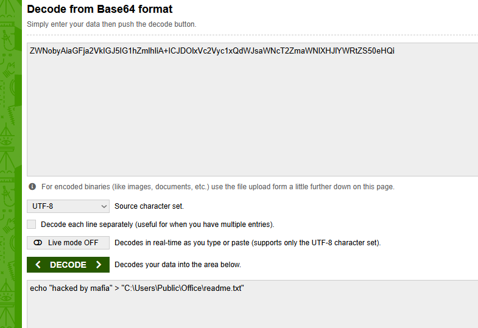

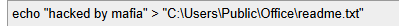

# Task 8

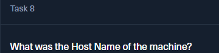

For this task, we need to list the environment variables of the process using `envars`:

```powershell
C:\Python27\python.exe .\vol.py -f C:\Users\analyst\Sherlocks\Recollection\recollection.bin --profile=Win7SP1x64 envars
```

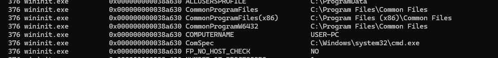

And we find `COMPUTERNAME` being `USER-PC`.

# Task 9


We found this in the previous output. When looking through the PowerShell command history, we saw the `net users` command being used and its output.

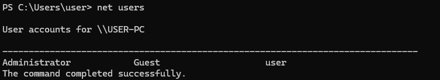

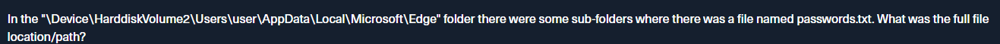

As a reminder, we ran this:

```powershell
C:\Python27\python.exe .\vol.py -f C:\Users\analyst\Sherlocks\Recollection\recollection.bin --profile=Win7SP1x64 consoles
```

# Task 10

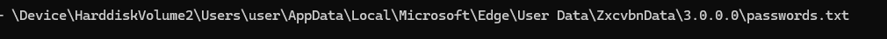

> In the "\Device\HarddiskVolume2\Users\user\AppData\Local\Microsoft\Edge" folder there were some sub-folders where there was a file named passwords.txt. What was the full file location/path?

For this task, we are looking for a file path recovered from the memory image, so `filescan` is the plugin we use. We then pipe it to `Select-String` to search based on the exercise request:

```powershell
C:\Python27\python.exe .\vol.py -f C:\Users\analyst\Sherlocks\Recollection\recollection.bin --profile=Win7SP1x64 filescan | Select-String "passwords.txt"
```

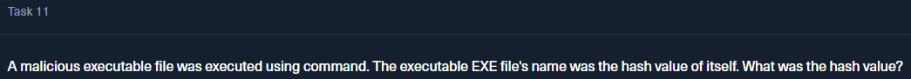

# Task 11

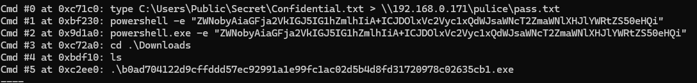

We saw that already in the PowerShell history command:


# Task 12

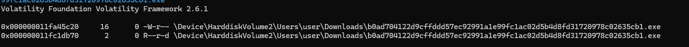

For this exercise, we need the executable since we need to calculate the Imphash from the actual `.exe`. We can do that using the right Volatility plugin to carve the `.exe` from the memory dump.

First, we look for the memory address of the file:

```powershell
C:\Python27\python.exe .\vol.py -f C:\Users\analyst\Sherlocks\Recollection\recollection.bin --profile=Win7SP1x64 filescan | Select-String "b0ad704122d9cffddd57ec92991a1e99fc1ac02d5b4d8fd31720978c02635cb1.exe"
```

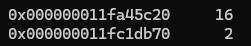

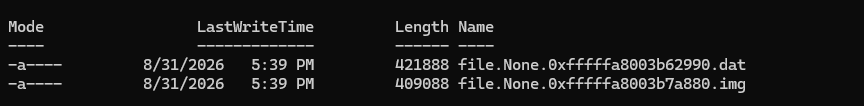

We then call for the dumping of the file:

```powershell
C:\Python27\python.exe .\vol.py -f C:\Users\analyst\Sherlocks\Recollection\recollection.bin --profile=Win7SP1x64 dumpfiles -Q 0x000000011fc1db70 -D C:\Users\analyst\Sherlocks\Recollection\dump
```

In this case, we target the file ending in `db70`.

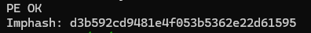

We get these files.

Then we run Imphash using `pefile` with:

```powershell
C:\Python313\python.exe -c "import pefile; pe=pefile.PE(r'.\file.None.0xfffffa8003b62990.dat'); print('PE OK'); print('Imphash:', pe.get_imphash())"
```


# Task 13

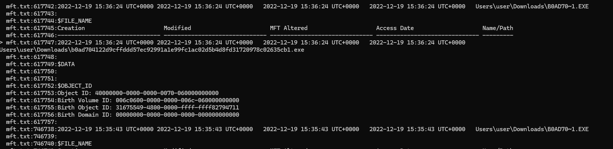

For this task, we need to search the MFT (Master File Table), the database that stores metadata of every file and folder on an NTFS volume.

We use the `mftparser` plugin and make it write the output to a `.txt` file that we can later search:

```powershell
C:\Python27\python.exe .\vol.py -f C:\Users\analyst\Sherlocks\Recollection\recollection.bin --profile=Win7SP1x64 mftparser > mft.txt
```

Then we search through it:

```powershell
Select-String -Path .\mft.txt -Pattern "b0ad704122d9cffddd57ec92991a1e99fc1ac02d5b4d8fd31720978c02635cb1.exe" -Context 5,10
```

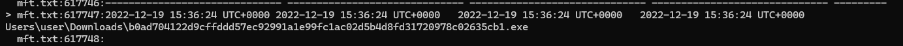

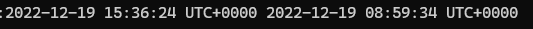


We see a weird pattern where the file is modified before being created. This points towards timestomping.

But the mistake here is that the MFT looks for when the file **was created on our machine**, but the file itself could have been created somewhere else way before. That's why we check the PE Headers.

```powershell
C:\Python313\python.exe -c "import pefile,datetime; pe=pefile.PE(r'C:\Users\analyst\Sherlocks\Recollection\dump\file.None.0xfffffa8003b62990.dat'); t=pe.FILE_HEADER.TimeDateStamp; print('Raw:',t); print('UTC:',datetime.datetime.fromtimestamp(t,datetime.timezone.utc))"
```

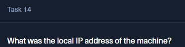

And this gives us the metadata for when the malicious file was actually created, compared to when it was created on **our system**.

# Task 14

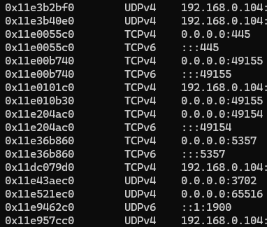

We're gonna use the network plugin from Volatility:

```powershell
C:\Python27\python.exe .\vol.py -f C:\Users\analyst\Sherlocks\Recollection\recollection.bin --profile=Win7SP1x64 netscan
```

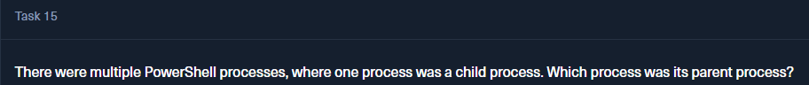

# Task 15

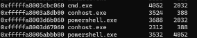

We know from the previous process scan that `cmd.exe` was the parent process of the second PowerShell.

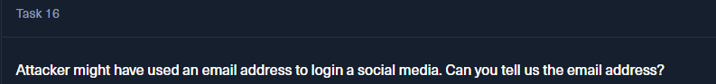

# Task 16

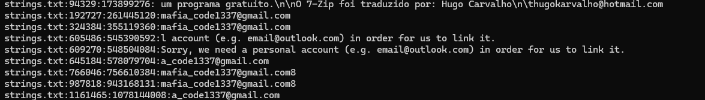

For this task, we will use the `strings` tool, which extracts human-readable text from a binary file.

```powershell
C:\Tools\Sysinternals\strings.exe -n 6 -o "C:\Users\analyst\Sherlocks\Recollection\recollection.bin" > strings.txt
```

Then, when it finishes, we search through the `.txt` file:

```powershell
Select-String -Path .\strings.txt -Pattern "@gmail.com|@hotmail.com|@outlook.com|@yahoo.com|@live.com"
```

For mail patterns:

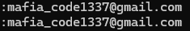

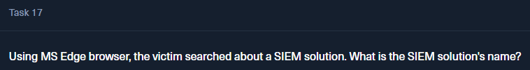

# Task 17

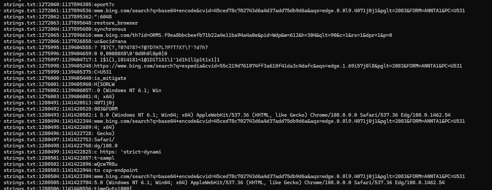

In this case, we could do another search over the `strings.txt` we already got, but the output is enormous:

```powershell
Select-String -Path .\strings.txt -Pattern "google.com/search|bing.com/search|search?q=" -CaseSensitive:$false -Context 3,5
```

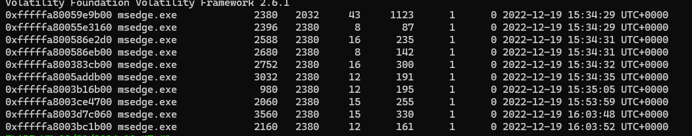

So first, we gather the PID of the `msedge.exe` process:

```powershell
C:\Python27\python.exe .\vol.py -f C:\Users\analyst\Sherlocks\Recollection\recollection.bin --profile=Win7SP1x64 pslist | findstr /i "msedge edge"
Volatility Foundation Volatility Framework 2.6.1
```

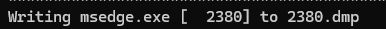

Then we do a memory dump of that PID, the first `msedge`:

```powershell
C:\Python27\python.exe .\vol.py -f C:\Users\analyst\Sherlocks\Recollection\recollection.bin --profile=Win7SP1x64 memdump -p 2380 -D C:\Users\analyst\Sherlocks\Recollection\edge_dump
```

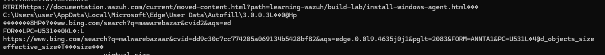

And then we search for strings over the dump:

```powershell
Select-String -Path C:\Users\analyst\Sherlocks\Recollection\edge_dump\*.dmp -Pattern "google.com/search","bing.com/search","SIEM" -CaseSensitive:$false
```

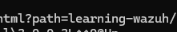

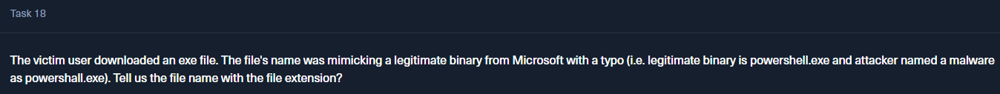

# Task 18


> The victim user downloaded an exe file. The file's name was mimicking a legitimate binary from Microsoft with a typo (i.e. legitimate binary is powershell.exe and attacker named a malware as powershall.exe). Tell us the file name with the file extension?

For this task, we just do a string search over the `mft.txt` we already have:

```powershell
Select-String -Path .\mft.txt -Pattern "Users\\user\\Downloads\\.*\.exe" -CaseSensitive:$false |
>> Select-Object -ExpandProperty Line
```

The actual legitimate Windows process is `csrss.exe`, which stands for Client Server Runtime Subsystem. It runs as a user-mode process and helps applications use the Windows API.

So we see the malicious binary has 3 `s`.