# ReliableThreat Sherlock

## Sherlock Scenario

> We have discovered a serious security breach involving the unauthorized exposure of our source code. An employee has been identified as a potential suspect in this incident. However, the employee strongly denies any involvement or downloading of external programs. We seek your expertise in digital forensic investigation to perform a comprehensive analysis, determine the root cause of the leak, and help us resolve the situation effectively.

We are given two files a `memory dump` and a disk image `.ad1`

# Task 1

`What is the application that starts the suspicious chain of processes?`

To start, as is usually recommended when analyzing memory dumps with Volatility, we call the `windows.info` plugin to get a grasp on the OS and kernel details of the memory sample.

```powershell
C:\Python313\Scripts\vol.exe -f C:\Users\analyst\Sherlocks\ReliableThreat\memdump.dmp windows.info
```

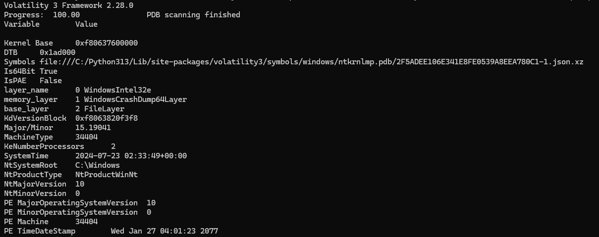

Then we can start looking at the parent-child relationships of the processes.

```powershell
C:\Python313\Scripts\vol.exe -f C:\Users\analyst\Sherlocks\ReliableThreat\memdump.dmp windows.pstree
```

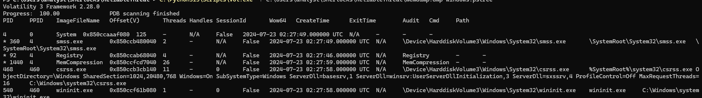

The first clue we find is a process using the name of a legitimate Windows process that normally lives under the Windows system directory:

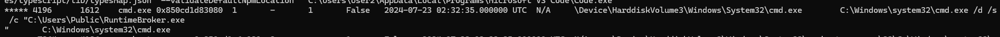

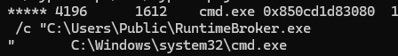

And if we follow the parent-child chain:

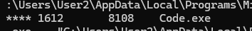

`Code.exe` with PID `1612` launches a `cmd.exe` with PID `4196`, which then runs the suspicious `RuntimeBroker.exe` with PID `1224`.

The legitimate `RuntimeBroker.exe` is a Windows process responsible for brokering permissions between UWP applications and protected system resources, helping enforce the permissions granted to those applications.

Now we can list the command lines used to see what arguments were passed when launching these different processes:

```powershell
C:\Python313\Scripts\vol.exe -f C:\Users\analyst\Sherlocks\ReliableThreat\memdump.dmp windows.cmdline
```

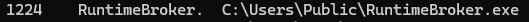

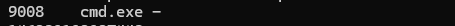

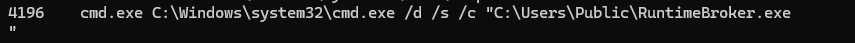

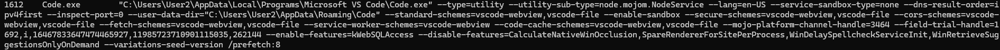

We see the clear chain, and we can assess that it is suspicious. `Code.exe` appears to be the start of the suspicious chain, since we only find `explorer.exe` launching the first instance of `Code.exe`, which then launches multiple processes.

# Task 2

`Provide the full path of the malicious file used to gain initial access.`

We found the suspicious `.exe` under the `C:\Users\Public\` directory, so we switch to the provided `.ad1` file to inspect the actual storage device and potentially analyze the binary that was executed.

For that, we use `FTK Imager`.

We navigate to the directory and do not find a matching filename, but we do find:

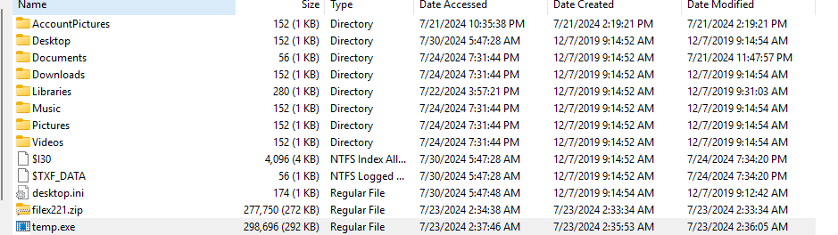

A binary called `temp.exe`. We export it to properly analyze it, and we can also get the file hash to check it through OSINT:

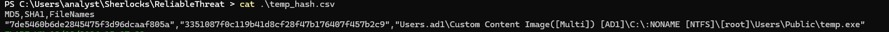

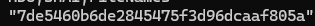

We get the hash, search for it online, and:

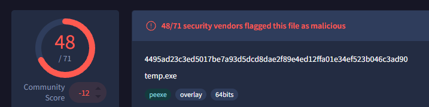

We get a hit. Known malware.

We continue our investigation with DiE to inspect the `.exe` and see if we can learn more about what it does or whether it drops additional files.

Scanning the strings of the binary, we quickly see that it uses PowerShell to perform a download.

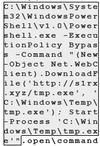

So far, we have a file named `temp.exe` in the `.ad1` that calls for a download of `tmp.exe`, which we cannot see on the storage.

And in memory we see `RuntimeBroker.exe`.

Another interesting fact is that we can see `RuntimeBroker.exe` in our memory dump, but not in the `.ad1` file. This could mean that the payload was loaded into memory without a corresponding standalone executable remaining on disk, although at this point we cannot confirm the exact injection or loading technique.

We call a file scan for `RuntimeBroker.exe`:

```powershell
C:\Python313\Scripts\vol.exe -f C:\Users\analyst\Sherlocks\ReliableThreat\memdump.dmp windows.filescan | Select-String "RuntimeBroker.exe"
```

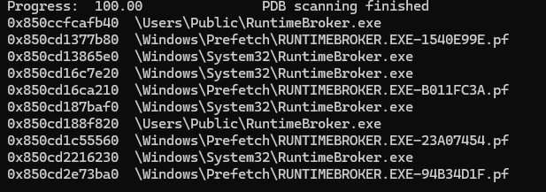

And then we dump the suspicious `.exe` based on its virtual address in memory:

```powershell
C:\Python313\Scripts\vol.exe -f C:\Users\analyst\Sherlocks\ReliableThreat\memdump.dmp windows.dumpfiles --virtaddr 0x850ccfcafb40
```

We inspect it with DiE.

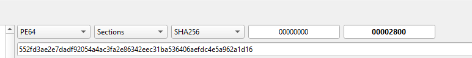

Get the hash and search for it.

We land with another hit:

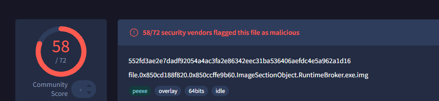

But we are still missing context to understand the whole chain.

We run:

```powershell
C:\Python313\Scripts\vol.exe -f C:\Users\analyst\Sherlocks\ReliableThreat\memdump.dmp windows.psscan | Select-String "temp.exe|tmp.exe|powershell.exe|RuntimeBroker.exe|cmd.exe|Code.exe"
```

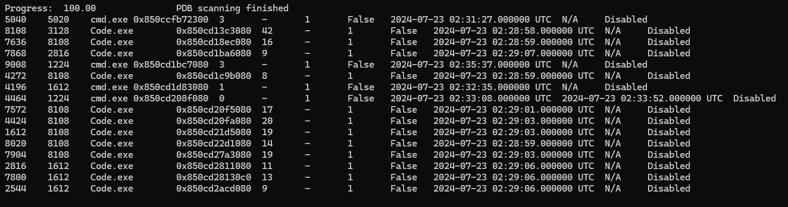

The question remains what `RuntimeBroker.exe` opened or interacted with.

```powershell
C:\Python313\Scripts\vol.exe -f C:\Users\analyst\Sherlocks\ReliableThreat\memdump.dmp windows.handles --pid 1224 | Select-String -Pattern "File|Users|Temp|Public|Downloads|Desktop|\.js|\.py|\.ps|\.sh"
```

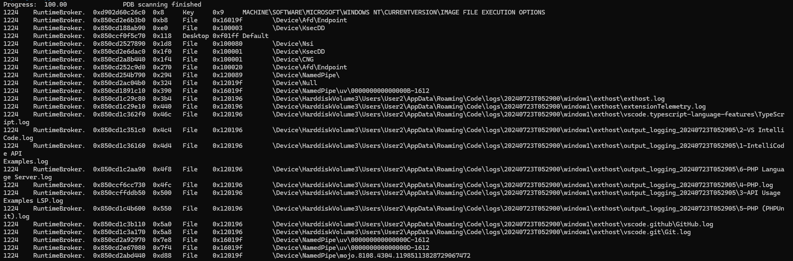


We see a pipe associated with PID `1612`, which is `Code.exe`.

Everything suggests that there must be a plugin, task, or similar mechanism executing the chain, since PID `1612` directly spawned `cmd.exe` to execute `RuntimeBroker.exe`.

In VS Code, automatic command execution can stem from:

- Workspace Tasks
- Launch Configurations
- Malicious Extensions
- Workspace/File Type Handlers

So we start searching for VS Code task and configuration artifacts:

```powershell
C:\Python313\Scripts\vol.exe -f C:\Users\analyst\Sherlocks\ReliableThreat\memdump.dmp windows.filescan | Select-String -Pattern "AppData\\Roaming\\Code|\.vscode"
```

Inspecting the massive output, we find:

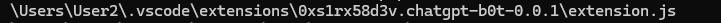

Matching exactly with the URL we found when inspecting the `temp.exe` binary:

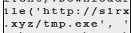

And potentially the name of the malicious actor, `s1rx`.

Next, we search for files in memory related to the string `0xs1rx58d3v`:

```powershell
C:\Python313\Scripts\vol.exe -f C:\Users\analyst\Sherlocks\ReliableThreat\memdump.dmp windows.filescan | Select-String -Pattern "0xs1rx58d3v"
```

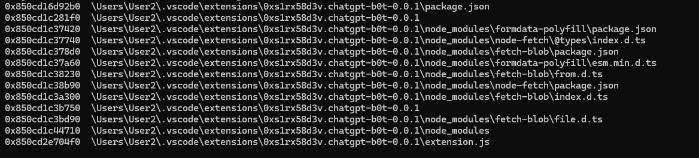

We get a clear picture of the whole extension.

# Task 3

`What user input, when executed, will run the malicious code?`

To determine the exact user input required to execute the malicious code, we need to inspect the extension's entry point.

So we proceed with dumping `package.json` and `extension.js` to inspect them further:

```powershell
C:\Python313\Scripts\vol.exe -o C:\Users\analyst\Sherlocks\ReliableThreat\s1rx-extension-dmp -f C:\Users\analyst\Sherlocks\ReliableThreat\memdump.dmp windows.dumpfiles --virtaddr 0x850cd16d92b0
```

```powershell
C:\Python313\Scripts\vol.exe -o C:\Users\analyst\Sherlocks\ReliableThreat\s1rx-extension-dmp -f C:\Users\analyst\Sherlocks\ReliableThreat\memdump.dmp windows.dumpfiles --virtaddr 0x850cd2e704f0
```

Analyzing the `extension.js` dump, we are met with a fake AI bot with preset answers:

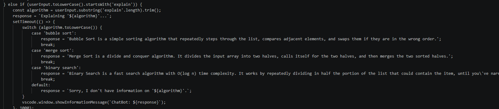

But if we inspect it more carefully:

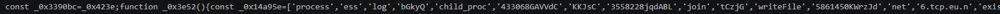

Pure obfuscated JavaScript.

We see that the obfuscated code is inside an `else if` check that includes `help`.

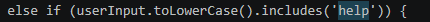

# Task 4

`What are the hostname and port used to establish a reverse shell?`

To do that, we grab the obfuscated JavaScript and bring it to a tool to deobfuscate it:

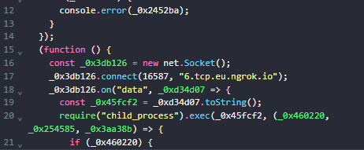

From here, we can clearly see the host and port used.

# Task 5

`What is the display name of the developer who created this malicious file?`

We find this in the `package.json` file that we dumped before:

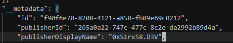

# Task 6

`What time was the malicious file released? (UTC).`

In this case, we can use the package metadata to query the Microsoft Extensions API:

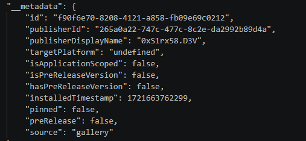

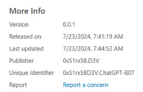

We just need to convert it to UTC.

# Task 7

`Provide the SID for the user who has been compromised.`

So we know that `User2` is the user hosting the malicious extension. We just need to use Volatility to list the user SIDs with the `windows.getsids` plugin:

```powershell
C:\Python313\Scripts\vol.exe -f C:\Users\analyst\Sherlocks\ReliableThreat\memdump.dmp windows.getsids --pid 8108
```

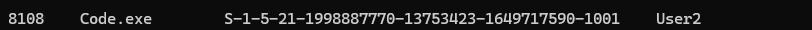

# Task 8

`Provide the full path of the suspicious executable being run during the infection chain.`

Based on our previous investigation, we know that the suspicious executable mimicking a legitimate Windows process is:

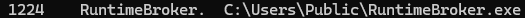

# Task 9

`The threat actor has modified the Windows registry to include a new entry. This change ensures that whenever a legitimate component runs, it triggers the malicious process, allowing the threat actor to maintain control of the system. Specify the name of the legitimate component.`

The task gives us a hint: `whenever a legitimate component runs, it triggers a malicious process`. This behavior is consistent with a hijacking mechanism such as COM hijacking, which can be used to execute malicious code when a legitimate application or system component instantiates a COM object.

A COM class is identified by a CLSID, and if the registry entry that defines the COM server is modified, a trusted application can be redirected to load malicious code instead.

Inspecting the `temp.exe` that we previously identified as malware, we can check its behavior based on OSINT:

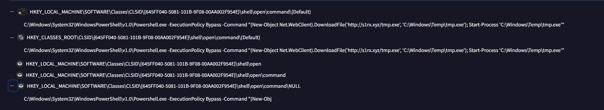

So we find that it changes the `CLSID {645FF040-5081-101B-9F08-00AA002F954E}`.

A quick search online:


# Task 10

`Which MITRE technique corresponds to the previous action?`

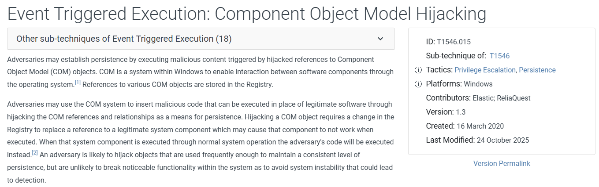

It corresponds to this technique because a legitimate Windows component or application instantiates a COM object through its unique GUID, the `CLSID`, and the attacker modifies how that COM object is resolved.

# Task 11

`The threat actor has identified the location for all projects and manipulated one of the project files. Could you provide details about the malicious code that was added by the threat actor?`

We use FTK Imager to scan the `User2` project files, and we eventually land here:

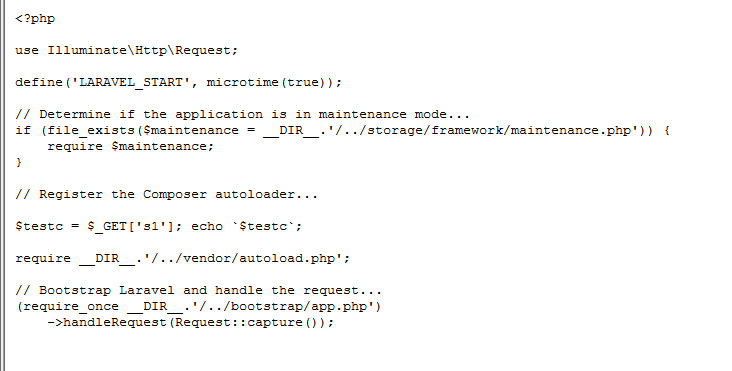

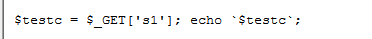

We compare it with the unzipped version found under `Users`:

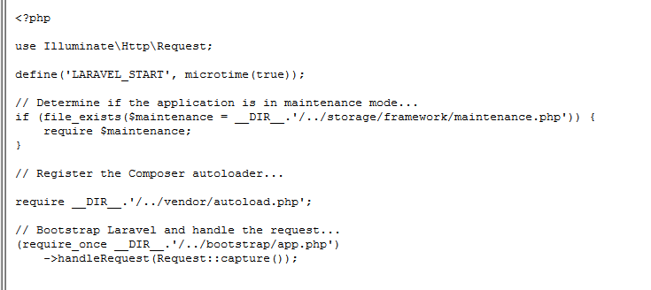

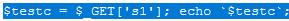

This code is effectively a command-execution backdoor. User-controlled input from the `s1` HTTP GET parameter is assigned directly to `$testc` and then executed using PHP's backtick shell-execution operator.

So `whoami` inside backticks effectively executes the `whoami` command through the system shell.