# RogueOne Sherlock

## Sherlock Scenario

> Your SIEM system generated multiple alerts in less than a minute, indicating potential C2 communication from Simon Stark's workstation. Despite Simon not noticing anything unusual, the IT team had him share screenshots of his task manager to check for any unusual processes. No suspicious processes were found, yet alerts about C2 communications persisted. The SOC manager then directed the immediate containment of the workstation and a memory dump for analysis. As a memory forensics expert, you are tasked with assisting the SOC team at Forela to investigate and resolve this urgent incident.

In this Sherlock we are given a single `.mem` file.

# Task 1

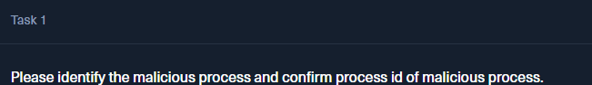

First we're gonna run a process listing function with Volatility:

```powershell
C:\Python313\Scripts\vol.exe -f .\20230810.mem windows.psscan
```

```powershell
C:\Python313\Scripts\vol.exe -f .\20230810.mem windows.pslist
```

Also, since the exercise talks about C2, we check for `netscan` too:

```powershell
C:\Python313\Scripts\vol.exe -f .\20230810.mem windows.netscan
```

We found a public IP connecting on port `8888`.


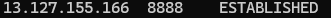

PID `6812` is connecting with a public IP.

Chaining the findings and then looking at parent relations with PIDs, we find:

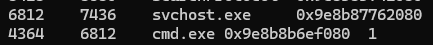

`svchost.exe` is the parent of `cmd.exe`.

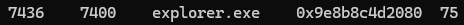

And then we find that `explorer.exe` is the parent of `svchost.exe`. This is unusual.

A legitimate `svchost.exe` is almost always started by the `services.exe` process, not by `explorer.exe`. This is a classic sign of **Parent PID (PPID) Spoofing**.

Just to further investigate the process, we look into the command line:

```powershell
C:\Python313\Scripts\vol.exe -f .\20230810.mem windows.cmdline --pid 6812
```

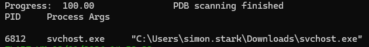

And here we find the biggest clue: a legitimate Windows process should not be located in a user's folder.

# Task 2

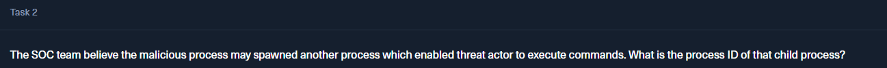

> The SOC team believe the malicious process may spawned another process which enabled threat actor to execute commands. What is the process ID of that child process?

We already saw this when we listed the processes and looked at their relationships:

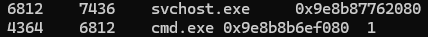

# Task 3

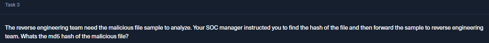

> The reverse engineering team need the malicious file sample to analyze. Your SOC manager instructed you to find the hash of the file and then forward the sample to reverse engineering team. What's the MD5 hash of the malicious file?

We need to get this fake `svchost.exe` that we found.

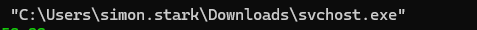

So the next step is to try and dump the files associated with the process:

```powershell
C:\Python313\Scripts\vol.exe -f .\20230810.mem windows.dumpfiles --pid 6812
```

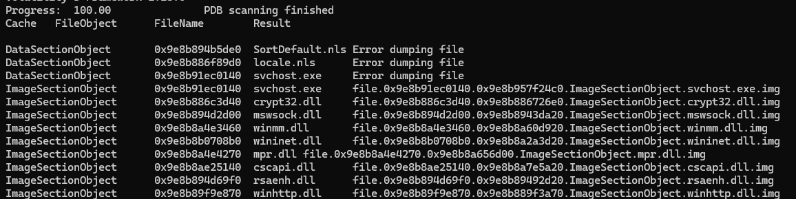

We see our file:


Then we use `Get-FileHash` to get the file hash:

```powershell
Get-FileHash file.0x9e8b91ec0140.0x9e8b957f24c0.ImageSectionObject.svchost.exe.img -Algorithm MD5
```

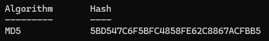

A quick look using OSINT will show us:

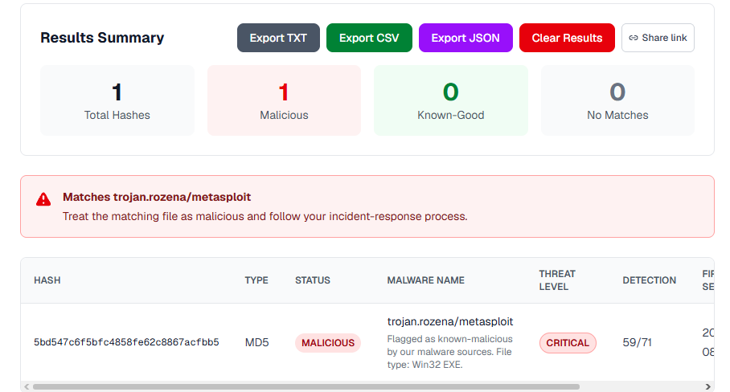

# Task 4


> In order to find the scope of the incident, the SOC manager has deployed a threat hunting team to sweep across the environment for any indicator of compromise. It would be a great help to the team if you are able to confirm the C2 IP address and ports so our team can utilise these in their sweep.

We already have the information from when we did the `netscan`:

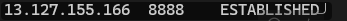

# Task 5

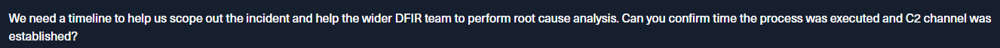

> We need a timeline to help us scope out the incident and help the wider DFIR team to perform root cause analysis. Can you confirm the time the process was executed and C2 channel was established?

The time of execution:

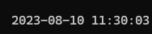

Same as the time of connection:

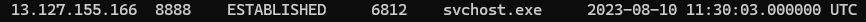

We just used `netscan` and `pslist`.

# Task 6


With a simple `pslist` on the PID of the process, we can see the relative memory address of the process:

```powershell
C:\Python313\Scripts\vol.exe -f .\20230810.mem windows.pslist --pid 6812
```

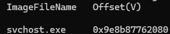

# Task 7


> You successfully analyzed a memory dump and received praise from your manager. The following day, your manager requests an update on the malicious file. You check VirusTotal and find that the file has already been uploaded, likely by the reverse engineering team. Your task is to determine when the sample was first submitted to VirusTotal.

This is asking us to do some research on the hash we found from the `.exe` and see what was the **First Submission** on VirusTotal.

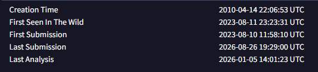

It's important to know the difference between **Creation Time**, when the actual binary was compiled, **First Seen In The Wild**, meaning the first records and hash checks over the malware, and the actual first time the binary was uploaded to VirusTotal.
