# Sherlock Scenario

> Simon Stark is a dev at forela who recently planned to stream some coding sessions with colleagues on which he received appreciation from CEO and other colleagues too. He unknowingly installed a well known streaming software which he found by google search and was one of the top URL being promoted by google ads. Unfortunately things took a wrong turn and a security incident took place. Analyze the triaged artifacts provided to find out what happened exactly.

# Task 1

> What's the original name of the malicious zip file which the user downloaded thinking it was a legit copy of the software?

My first instinct was to search through the artifacts around Microsoft Edge history files but could not find any relevant data, so I switched to an initial file scan. Checking the Recent Windows directory, we find something that matches the description from the initial assessment.

Also, we can see its file path is under Downloads.

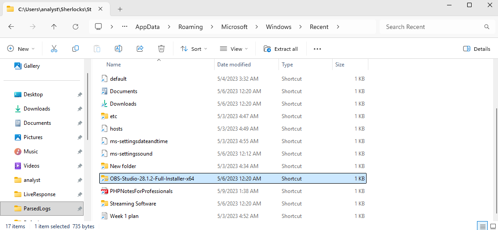

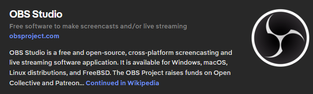

With OBS being a streaming service, this is a good starting point to investigate the nature of this `.zip`.

# Task 2

> Simon Stark renamed the downloaded zip file to something else. What's the renamed Name of the file alongside the full path?

For file renaming, a good artifact to inspect is `$J`, which is the secondary data stream that records filesystem changes as part of the USN Journal (`$Extend\$UsnJrnl:$J`).

We use MFTECmd from Eric Zimmerman's tools:

```powershell
./MFTECmd.exe -f "C:\Users\analyst\Sherlocks\Streamer\Acquisition\C\`$Extend\`$J" --csv "C:\Temp\USN"
```

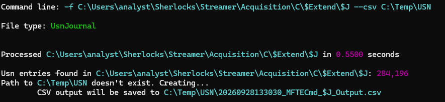

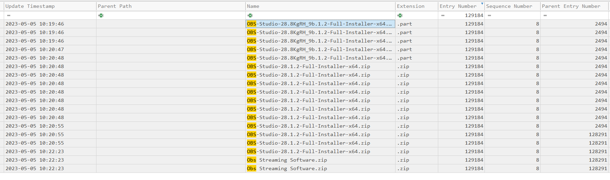

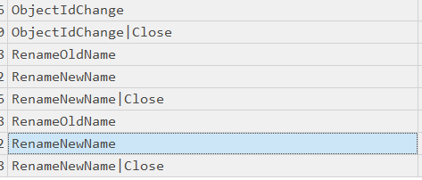

We find the timeline showing how it was initially `.part` files while downloading, then became a full `.zip`, and finally was renamed to `Obs Streaming Software`, all sharing the same File Name Entry Number and Parent Entry Number.

# Task 3

> What's the timestamp when the file was renamed?

For this task, we use the same `.csv` we already parsed.

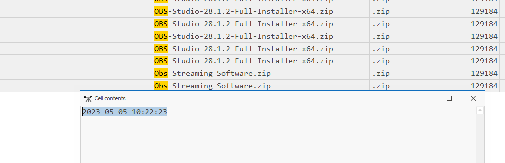

# Task 4

> What's the Full URL from where the software was downloaded?

Previously, while inspecting `$MFT` records, we found an interesting `Zone.Identifier` Alternate Data Stream (ADS) with valuable metadata.

Windows uses `Zone.Identifier` to store Mark-of-the-Web (MotW) information about files obtained from external/untrusted locations.

It is important to understand that ADSs are like extra data streams attached to a file, and each extra stream can actually contain its own payload. In fact, there are many cases where this design has been abused to conceal malware through ADS manipulation.

In our case, if we inspect the contents of this ADS:

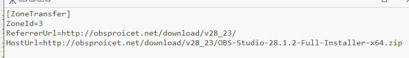

We find the URL from where the file was downloaded.

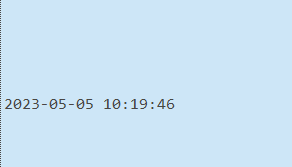

So far, we have a good timeline evaluation pointing towards closely linked events.

# Task 5

> Dig down deeper and find the IP Address on which the malicious domain was being hosted.

For this, we find that we have access to `.evtx` DNS Client Operational logs and the domain name we gathered from the `Zone.Identifier` ADS, making it a prime candidate to find a history of DNS queries and how they were resolved.

Parsing the DNS `.evtx`:

```powershell
./EvtxECmd.exe -f "C:\Users\analyst\Sherlocks\Streamer\Acquisition\C\Windows\System32\winevt\Logs\Archive-Microsoft-Windows-DNS-Client%4Operational-2023-05-05-10-31-18-874.evtx" --csv "C:\Temp\DNS"
```

We look for Type 1 (A) query events that return a result:

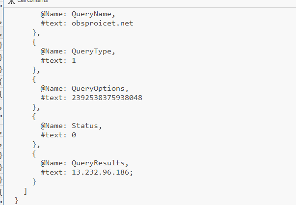

# Task 6

> Multiple Source ports connected to communicate and download the malicious file from the malicious website. Answer the highest source port number from which the machine connected to the malicious website.

We have the IP address and the domain name, but we are lacking the ports.

One artifact that records actual connections with their source and destination ports is a Firewall log that records network traffic events, and in this case, we do have such an artifact.

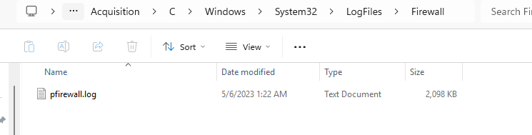

Now, since we have the IP address, we can search for all occurrences and identify all connection events with their respective source ports.

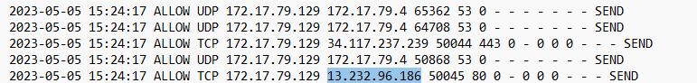

We find a total of 6 connections.

# Task 7

> The zip file had a malicious setup file in it which would install a piece of malware and a legit instance of OBS studio software so the user has no idea they got compromised. Find the hash of the setup file.

Going back to the `$MFT` records, we can find two `.exe` files with the same name, but with different file sizes and paths. A possibility could be that the installer drops legitimate software alongside the malware to cover its presence.

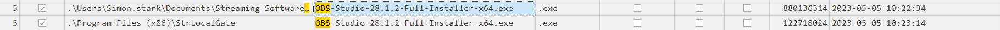

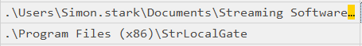

Since we do not have that `.exe` file on disk to hash directly, one thing we can try is searching through the provided `Amcache.hve` Windows registry hive.

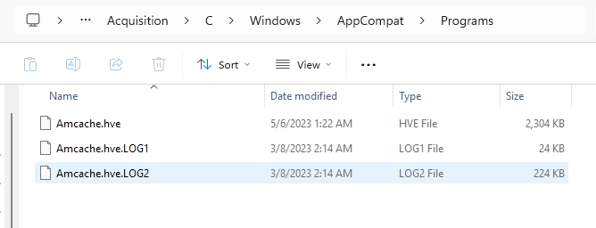

Amcache serves as a historical inventory of executable files that Windows has encountered.

It preserves information such as filename, full path, SHA-1 hash, file size, and execution timestamps.

To parse this file, we use `AmcacheParser`:

```powershell
./AmcacheParser.exe -f "C:\Users\analyst\Sherlocks\Streamer\Acquisition\C\Windows\AppCompat\Programs\Amcache.hve" --csv "C:\Temp\Amcache"
```

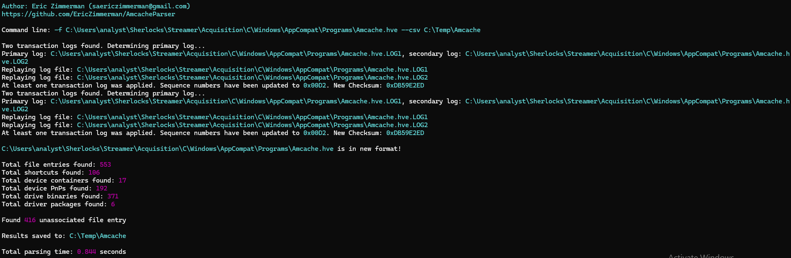

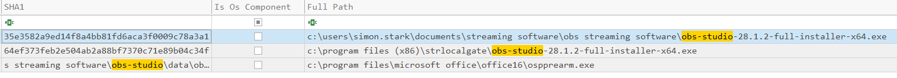

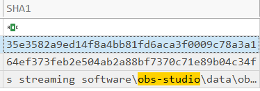

We find both binaries installed in different paths along with their SHA-1 hashes.

# Task 8

> The malicious software automatically installed a backdoor on the victim's workstation. What's the name and filepath of the backdoor?

The task is asking what file was created/installed by the malicious software that functions as a backdoor. For this, we go back to the `$MFT` records to find file creation events occurring right after `StrLocalGate` was created alongside the OBS `.exe`.

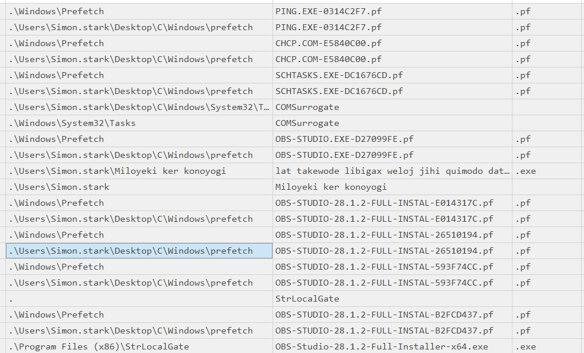

We find a suspicious `.exe` with a randomized name.

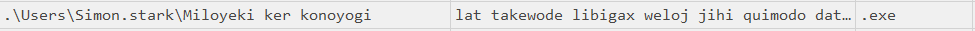

We also find it referenced in our Prefetch files.

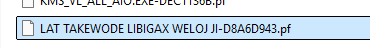

We parse the Prefetch file using PECmd:

```powershell
.\PECmd.exe -f "C:\Users\analyst\Sherlocks\Streamer\Acquisition\C\Windows\prefetch\LAT TAKEWODE LIBIGAX WELOJ JI-D8A6D943.pf"
```

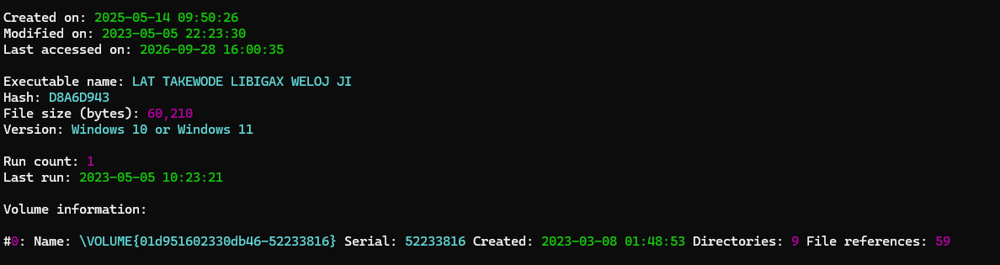

It ran at `2023-05-05 10:23:21`, just 7 seconds after the `StrLocalGate` directory was created and the OBS installer was dropped.

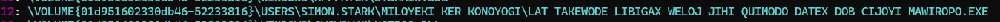

Around the same timestamp, a scheduled task named `COMSurrogate` is created under `System32\Tasks`.

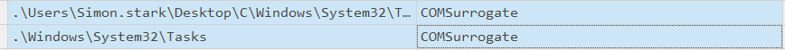

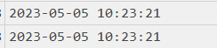

This is especially suspicious because COM Surrogate (`dllhost.exe`) is a legitimate Windows OS process, not a Scheduled Task.

The legitimate function of COM Surrogate is to act as a wrapper container for running COM objects. If an unstable COM object crashes, only `dllhost.exe` crashes while the main binary invoking the object stays alive.

In this scenario, this points to a known threat actor technique (like Colibri Loader) using the same name to disguise itself. However, because COM Surrogate is NOT a scheduled task by default, this naming anomaly is strong evidence of malicious persistence.

We go ahead and inspect the task XML file:

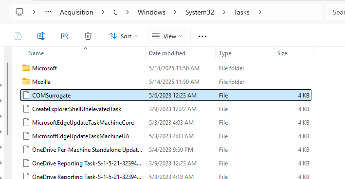

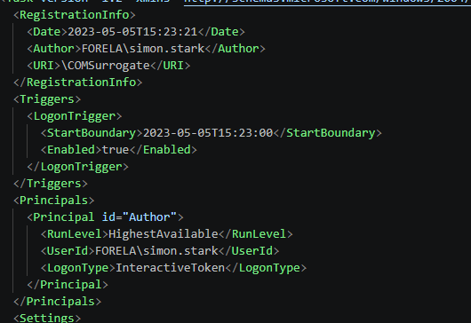

We find it triggers on every logon for user `simon`.

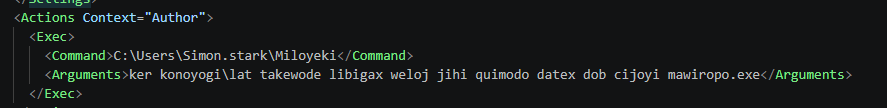

And we find the randomized backdoor binary listed as the execution argument. This is classic backdoor persistence behavior: on every logon event, the binary executes.

# Task 9

> Find the prefetch hash of the backdoor.

Going back to the Prefetch data we already parsed, we can locate the hash.

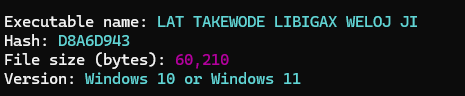

# Task 10

> The backdoor is also used as a persistence mechanism in a stealthy manner to blend in the environment. What's the name used for persistence mechanism to make it look legit?

As discussed previously, it uses the legitimate Windows component name `COMSurrogate` to disguise itself. The key concept here is that `COMSurrogate` is not a default scheduled task, so this attempt at masquerading provides clear proof of malicious activity.

# Task 11

> What's the bogus/invalid randomly named domain which the malware tried to reach?

Taking into account the exact timestamps and knowing that the binary executed at:

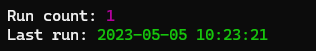

`2023-05-05 10:23:21`

We can go back to the parsed DNS records and look at queries originating seconds later:

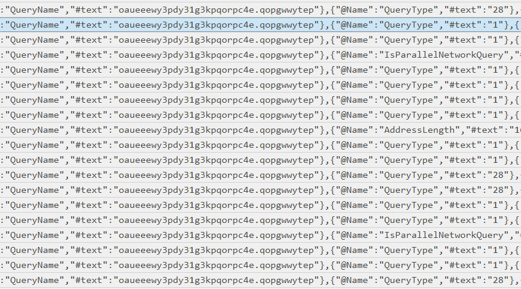

# Task 12

> The malware tried exfiltrating the data to a s3 bucket. What's the url of s3 bucket?

An S3 bucket is a public cloud storage container in Amazon Web Services (AWS) Simple Storage Service.

To locate references to it, we can perform a recursive text search across files in the triage directory:

```powershell
Get-ChildItem "C:\Users\analyst\Sherlocks\Streamer\Acquisition\C" -Recurse -File -ErrorAction SilentlyContinue |
    Select-String -Pattern "s3\.amazonaws\.com|amazonaws\.com|s3://" -AllMatches -ErrorAction SilentlyContinue |
    Select-Object Path, LineNumber, Line
```

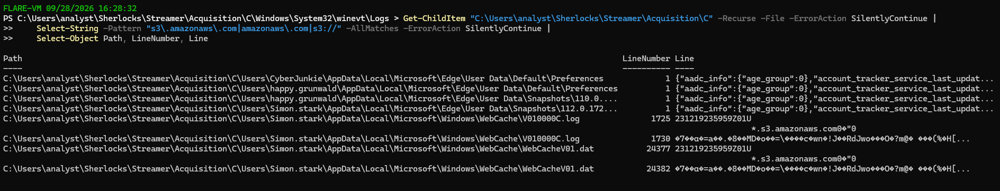

We hit different files, but `WebCacheV01.dat` stands out. It is an Extensible Storage Engine (ESE) database used by Windows to store web browsing and system activity data.

Since it is a binary ESE database, some text might be unreadable, but we can extract ASCII/Unicode strings:

```powershell
strings.exe -n 6 "C:\Users\analyst\Sherlocks\Streamer\Acquisition\C\Users\Simon.stark\AppData\Local\Microsoft\Windows\WebCache\WebCacheV01.dat" |  
Select-String -Pattern "s3\.amazonaws\.com" -Context 5,5
```

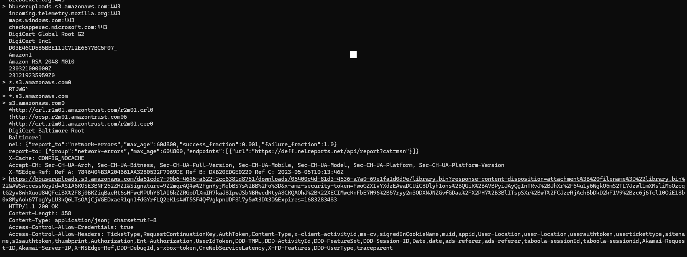


We find the full S3 bucket URL.

# Task 13

> What topic was simon going to stream about in week 1? Find a note or something similar and recover its content to answer the question.

We can search the `$MFT` records for keywords like `Week` or `Week 1`.

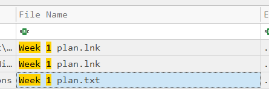

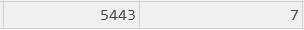

We find a `.txt` file with entry number 5443, which allows us to inspect the record deeper:

```powershell
./MFTECmd.exe -f "C:\Users\analyst\Sherlocks\Streamer\Acquisition\C\`$MFT" --de 5443
```

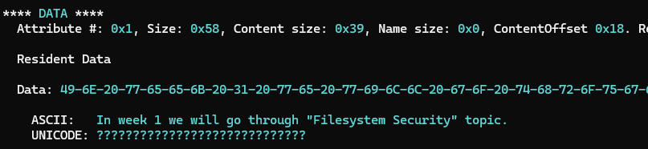

Using the `--de` flag dumps specific detail for that targeted file entry, allowing us to read resident attribute data directly stored inside the `$MFT`.

# Task 14

> What's the name of Security Analyst who triaged the infected workstation?

We find that KAPE (Kroll Artifact Parser and Extractor), an artifact collection tool, was run 3 days after the event.

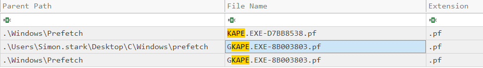

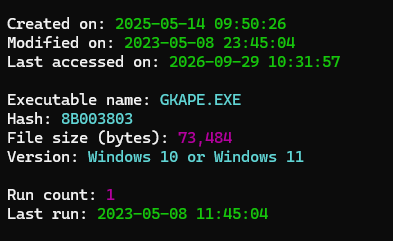

We also found a diagnostics script that executed at `2023-05-08 10:15:03`:

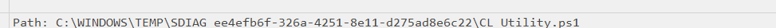

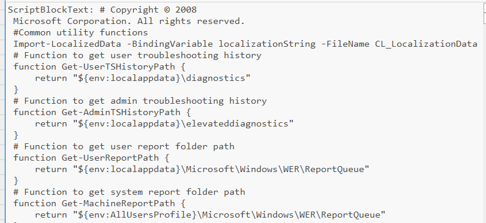

Under the Recent directory for user `CyberJunkie`, we find several artifacts indicative of system administration activity.

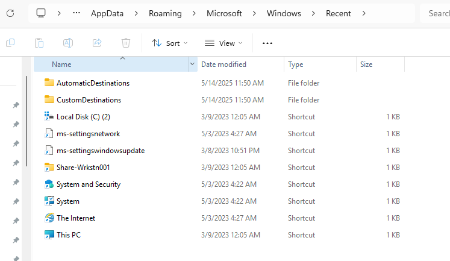

Inspecting the shortcut using LECmd:

```powershell
./LECmd.exe -f "C:\Users\analyst\Sherlocks\Sherlocks\Streamer\Acquisition\C\Users\CyberJunkie\AppData\Roaming\Microsoft\Windows\Recent\Share-Wrkstn001.lnk"
```

We find that `CyberJunkie` interacted with `Share-Wrkstn001` on the forela network.

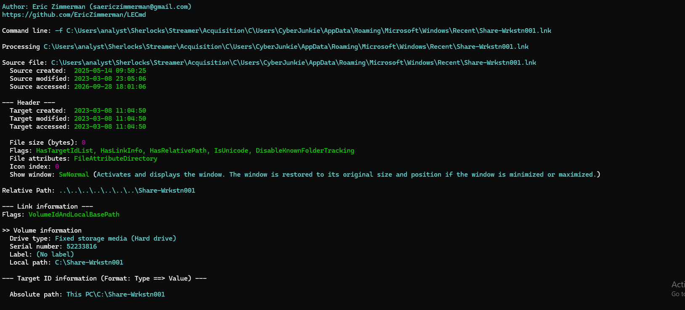

Another way to gather context is through Shellbags, which record user interactions with folders in Windows Explorer to preserve folder view settings.

Forensically, each entry stores full folder paths (including network shares and removable drives), proving folder access.

We use `SBECmd.exe` to parse Shellbag structures inside `NTUSER.DAT` registry hives:

```powershell
./SBECmd.exe -d "C:\Users\analyst\Sherlocks\Streamer\Acquisition\C\Users\Simon.stark" --csv C:\Temp\SimonShellBags
```

The hive for `CyberJunkie` returned minimal findings:

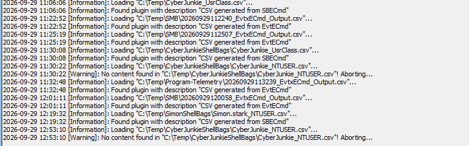

However, inspecting the hive for `Simon.stark`:

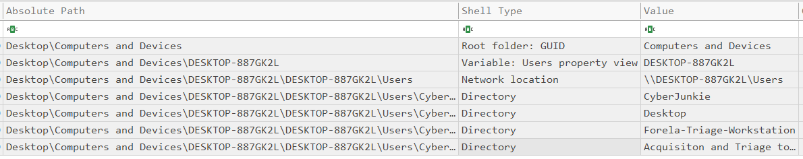

After reconstructing how Windows stores folder views within the registry, we see that the triage tools accessed were stored under the `CyberJunkie` user profile. This matches our previous findings regarding tools used by this account.

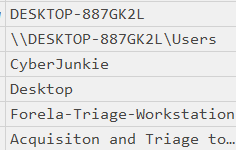

We also notice that the actual triage folders were created on `2023-05-08 11:38:46`, whereas the `CyberJunkie` user account already existed days prior.

# Task 15

> What's the network path from where acquisition tools were run?

Using the parsed Shellbags output, we can clearly identify the network path used.

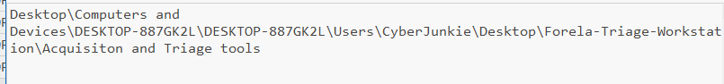