# Sherlock Scenario

> A junior SOC analyst on duty has reported multiple alerts indicating the presence of PsExec on a workstation. They verified the alerts and escalated them to Tier II. As an Incident Responder, you triaged the endpoint for artifacts of interest. Now, please answer the questions regarding this security event so you can report it to your Incident Manager.

# Task 1

`The SOC Team suspects that an adversary is lurking in their environment and are using PsExec to move laterally. A junior SOC Analyst specifically reported the usage of PsExec on a WorkStation. How many times was PsExec executed by the attacker on the system?`

PsExec is a command-line tool that allows users to run programs and execute commands on remote Windows systems without needing to install client software.

Windows does not have a built-in "run this EXE remotely" API. The way PsExec allows one machine to tell another machine to run a program with system privileges is by installing and starting a service, so we will use the `System.evtx` log to investigate this.

We look for Event ID `7045`, which corresponds to a service being installed.

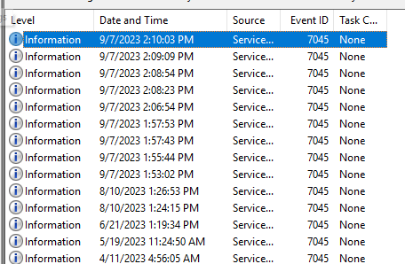

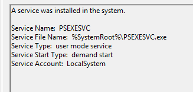

We found `9` instances of this service installation.

# Task 2

`What is the name of the service binary dropped by PsExec tool allowing attacker to execute remote commands?`

In the same event we can see the binary name.

PsExec copies its service component to the target's Windows directory via the `ADMIN$` share, then creates the `PSEXESVC` service pointing to that executable.


# Task 3

`Now we have confirmed that PsExec ran multiple times, we are particularly interested in the 5th Last instance of the PsExec. What is the timestamp when the PsExec Service binary ran?`

A good way to properly find the timestamps of program execution is using `PECmd` on the Prefetch files, since these files contain basic metadata about program execution.

```powershell
./PECmd.exe -f "C:\Users\analyst\Sherlocks\Tracer\C\Windows\prefetch\PSEXESVC.EXE-AD70946C.pf"
```

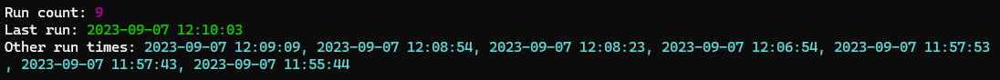

In this case the question wants the 5th LAST execution, so we count backwards from the last run.

1 - 


2 -


...

5 -

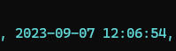

# Task 4

`Can you confirm the hostname of the workstation from which attacker moved laterally?`

The task question can be misleading with its wording, but apparently it wants us to tell it which machine the attacker moved to, not the machine they moved from.

To find this out, we will look for process creations to see where the binary was run from and catch the command-line arguments.

For that we go to the `Microsoft-Windows-Sysmon-Operational.evtx` log file and search for Event ID `1`, which is process creation.

We see clear clues that `Wkstn002` is the original compromised machine.

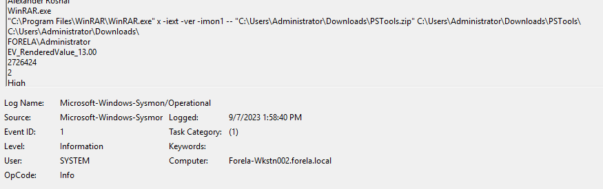

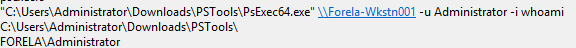

And then we find this command line that points to the attacker trying to pivot into `Wkstn001`.

So we know that `Wkstn002` is the machine where `PSExec64.exe` was launched, and `Wkstn001` is the machine where PsExec connected to.

# Task 5

`What is full name of the Key File dropped by 5th last instance of the Psexec?`

First we need to understand what a Key file is from PsExec.

When PsExec runs, it drops a unique `.key` file into the `C:\Windows` directory on the target system. The creation of this file is logged in the NTFS USN Journal.

The NTFS USN Journal is a hidden, built-in feature of the NTFS file system that acts as a constant activity log of changes made to files and folders on an NTFS volume.

It basically records what changed, when it changed, and what caused the change.

Knowing this, we want to analyze the NTFS USN Journal that we were given, which is the `$J` file, while `$Max` contains metadata about the journal.

For that we first parse the journal with `MFTECmd`, after renaming the files to avoid conflicts with PowerShell interpreting `$` as a variable:

```powershell
& "C:\Users\analyst\Tools\net9\MFTECmd.exe" -f "C:\Users\analyst\Sherlocks\Tracer\C\Extend\USN_Journal" --csv "C:\Users\analyst\Desktop"
```

We parse it with the tool and create a `.csv` file that we can properly analyze.

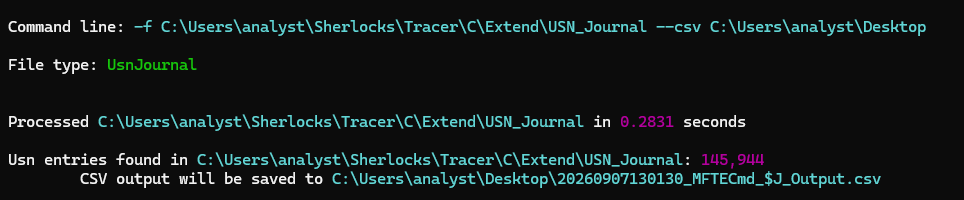

Then we need to inspect properly what names and properties the journal contains.

First we create a variable so it's easier to use the `.csv` file in our commands:

```powershell
$csv = Import-Csv "C:\Users\analyst\Desktop\20260907130130_MFTECmd_J_Output.csv"
```

Then we start inspecting its contents:

```powershell
$csv[0].PSObject.Properties.Name
```

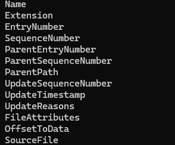

We do a short list of the entries to confirm their nature:

```powershell
$csv | Select-Object -First 3 | Format-List
```

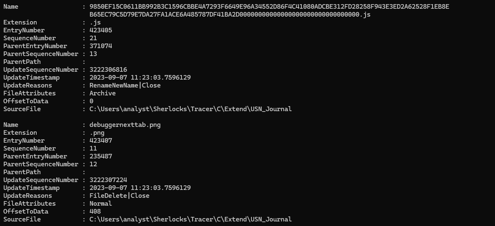

Then we proceed with a proper search for `.key` files:

```powershell
$csv | Where-Object { $_.Extension -eq ".key" } |
Select-Object UpdateTimestamp, Name, Extension, UpdateReasons |
Format-Table -AutoSize
```

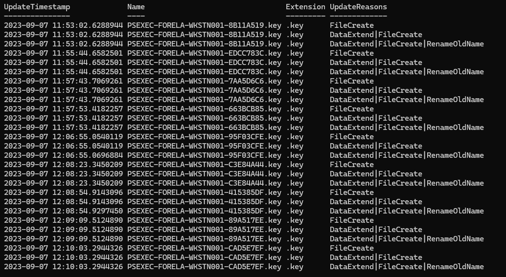

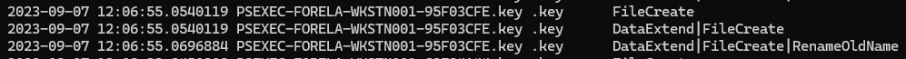

We found the `.key` files, and we just need to get the one that corresponds to the 5th instance timestamp we found before.

# Task 6

`Can you confirm the timestamp when this key file was created on disk?`

Since we already got the right `.key` file, we can check the timestamp corresponding to `FileCreate`.

```powershell
$csv | Where-Object { $_.Name -eq "PSEXEC-FORELA-WKSTN001-95F03CFE.key" } |
Select-Object Name, UpdateTimestamp, UpdateReasons |
Format-List
```

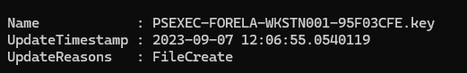

# Task 7

`What is the full name of the Named Pipe ending with the "stderr" keyword for the 5th last instance of the PsExec?`

Named pipes are a Windows IPC mechanism. They let two processes communicate with each other, where one program's output becomes the other program's input without needing to write or read from a disk.

To find the pipes created, we want to go to the `Sysmon Operational.evtx` file and search for Event ID `17`, which corresponds to a pipe being created.

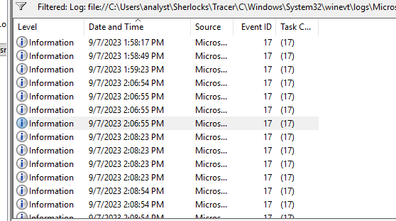

Then we just need to correlate the date and time and search for `C:\WINDOWS\PSEXESVC.exe`.

It's important to note that Event Logs are transformed into local time, but if we look at the event details, we can see the actual UTC time for proper comparison.

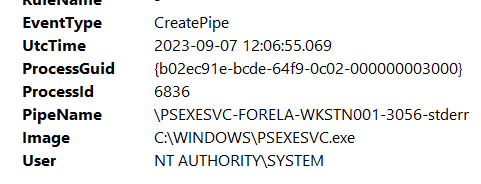

This is the event that matches the 5th PsExec execution.
