# Sherlock Scenario

>John Grunewald was deleting some old accounting documents when he accidentally deleted an important document he had been working on. He panicked and downloaded some software to recover the document, but after installing it, his PC started behaving strangely. Feeling even more demoralised and depressed, he alerted the IT department, who immediately locked down the workstation and recovered some forensic evidence.

>Now it is up to us to analyze the evidence and understand what happened on John's workstation.


# Task 1

`What is the build version of the operating system?`

For this question we will use Volatility on the `memory.vmem` file:

```powershell
C:\Python313\Scripts\vol.exe -f memory.vmem windows.info
```

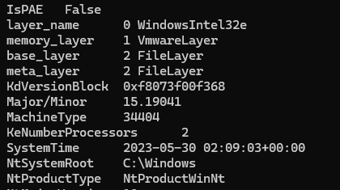

On the `Major/Minor` value we can see `15.199041`. The `15` is related to the kernel/PDB symbol information, while `19041` is the Windows build number.

# Task 2

`What is the computer hostname?`

For this question we will use `windows.envars` because Windows stores the computer hostname in the environment variables.

```powershell
C:\Python313\Scripts\vol.exe -f memory.vmem windows.envars
```

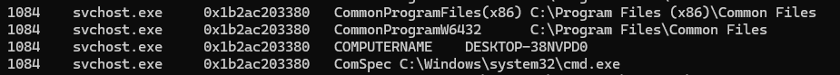

# Task 3

`What is the name of the downloaded ZIP file?`

For this question we will use a tool called `FTK Imager` from Exterro and load the Image File `.ad1` into it.

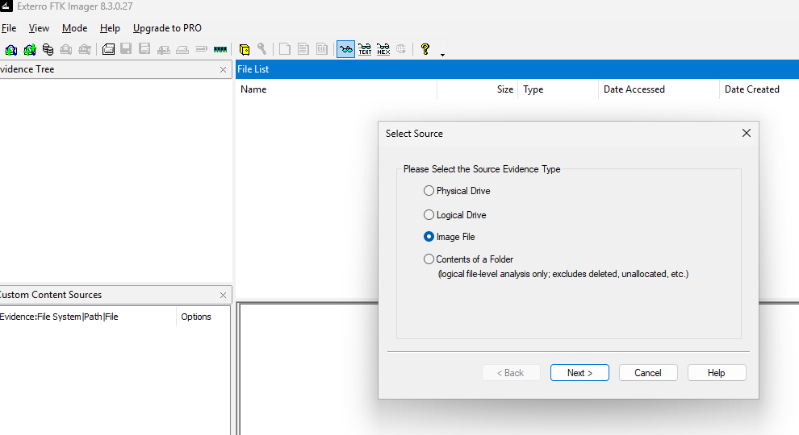

After loading the image, we look for the Downloads folder.

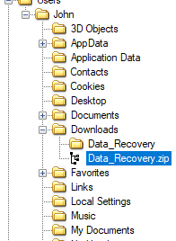

We find the `.zip` with a name that matches what the user wanted to do, which was recover some data.

# Task 4

`What is the domain of the website (including the third-level domain) from which the file was downloaded?`

For this task we use Wireshark and open the network capture file we were given.

We find a big clue by filtering over `http.request`.

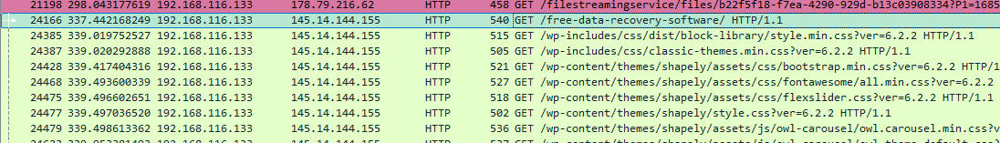


Inspecting the HTTP request we can see the domain from where the file was downloaded.

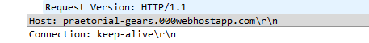

# Task 5

`The user then executed the suspicious application found in the ZIP archive. What is the process PID?`

For this task we need to go back to Volatility, but we can also use the extra information that FTK Imager gave us about the `.exe` file.

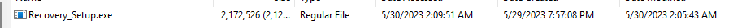

So then we list the running processes:

```powershell
C:\Python313\Scripts\vol.exe -f memory.vmem windows.pslist
```

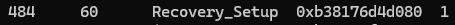

From the process list we can identify the suspicious executable and its PID.

# Task 6

`What is the full path of the suspicious process?`

We use the `cmdline` plugin from Volatility, which can expose the path from where the process was executed.

```powershell
C:\Python313\Scripts\vol.exe -f memory.vmem windows.cmdline
```


# Task 7

`What is the SHA-256 hash of the suspicious executable?`

For this we can use FTK Imager since it makes it easy to get the files we want to analyze.

In this case we export the file.

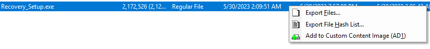

With the file on our system, we can use the `Get-FileHash` cmdlet:

```powershell
Get-FileHash ".\Recovery_Setup.exe" -Algorithm SHA256
```

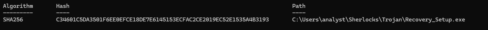

# Task 8

`When was the malicious program first executed?`

We are going to use FTK Imager over the `.ad1` file since it gives us easy access to the Windows Prefetch files.

Prefetch is a Windows optimization technology that tracks how applications are loaded into memory. Every time an `.exe` file is run from a particular location for the first time, Windows creates the corresponding `.pf` file in the Prefetch directory.

On subsequent launches, the system can use this file to pre-load data and code, making the application start faster.

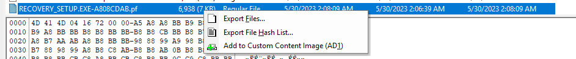

Once we have the `.pf` file, we can run `PECmd`, which will properly parse the whole contents of the Prefetch file, while FTK Imager only showed us the basic metadata.

```powershell
C:\Users\analyst\Tools\net9\PECmd.exe -f ".\RECOVERY_SETUP.EXE-A808CDAB.pf"
```

From the output of the tool we can see the run times and their dates:


# Task 9

`How many times in total has the malicious application been executed?`

From the previous output we get the execution count:

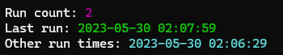

# Task 10

`The malicious application references two .TMP files, one is IS-NJBAT.TMP, which is the other?`

We started the search on the `.exe` to see if the binary exposed any readable strings, but we couldn't find anything.

Then we switched towards the memory dump. Since the program had already run, it could have unpacked data, constructed strings dynamically, loaded the `.tmp` files, etc., so checking the memory was the right call.

In our case we use a tool called `HxD` and after a search we find the other `.TMP` file:

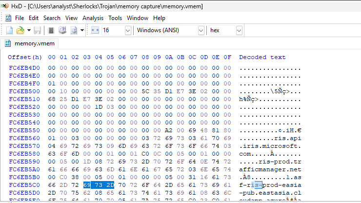

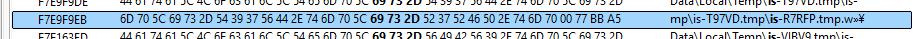

# Task 11

`How many of the URLs contacted by the malicious application were detected as malicious by VirusTotal?`

For this task we will use Wireshark and filter for `http.request`. Then we can see which hosts the application is contacting and check them on VirusTotal.

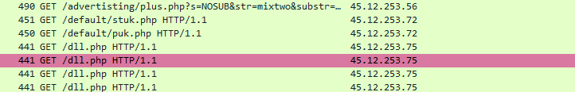

We find this public IP and see that its ranges are flagged:


We also find the main domain where the user grabbed the malicious binary.


It is not flagged, but it is also not being cleared by the community, so we should still keep it in mind.

# Task 12

`The malicious application downloaded a binary file from one of the C2 URLs, what is the name of the file?`

For this task we keep using Wireshark and use one of its built-in features.

We go to `File -> Export Objects`.

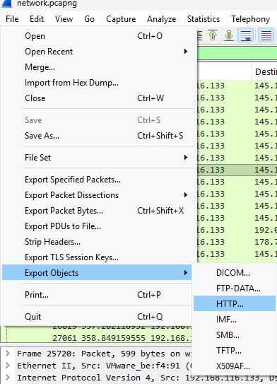

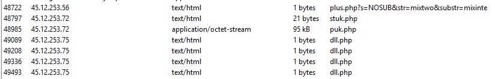

This shows us many HTML/text files, probably related to setting up status/configuration, redirects, etc.

However, the actual binary file is of type `application/octet-stream`. We can also identify it by its size.

# Task 13

`Can you find any indication of the actual name and version of the program that the malware is pretending to be?`

In previous steps we tried to analyze the `Recovery_Setup.exe` file with `innounp`.

Since we identified with DiE the nature of the installer, and `innounp` is a utility used to extract contents from installer files created with Inno Setup, we tried to extract it. It asked for a password, but it also revealed another binary inside.

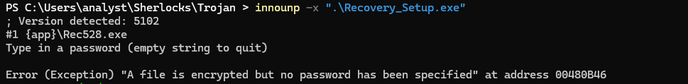

So `Recovery_Setup.exe` is the installer/wrapper, while `Rec528.exe` is the actual malware.

We then do a search using `HxD` for the `.exe` file.

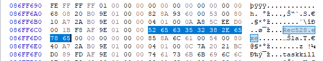

So we proceed to see if it existed in memory as a process using Volatility:

```powershell
C:\Python313\Scripts\vol.exe -f memory.vmem windows.pslist | findstr /i "Rec528"
```

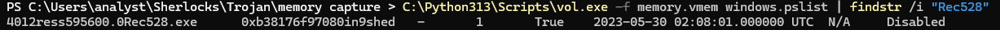

We find the PID `4012`.

We then dump the memory related to the process:

```powershell
C:\Python313\Scripts\vol.exe -f memory.vmem windows.memmap --pid 4012 --dump
```


Eventually, we went back to do some OSINT on the file hash we found previously.

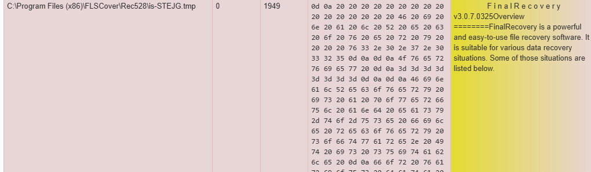

This gives us an indication of the actual program that the malware was pretending to be.

Probably another possible route to solve this was to do a deep inspection of all the files that the malware dropped or downloaded.