# Unit42 Sherlock

## Sherlock Scenario

> In this Sherlock, you will familiarize yourself with Sysmon logs and various useful EventIDs for identifying and analyzing malicious activities on a Windows system. Palo Alto's Unit42 recently conducted research on an UltraVNC campaign, wherein attackers utilized a backdoored version of UltraVNC to maintain access to systems. This lab is inspired by that campaign and guides participants through the initial access stage of the campaign.

> To answer the questions in this lab, you will only need the Event Viewer, with VirusTotal as an optional supplement. Below are some important Sysmon Event IDs that can be utilized in your analysis:

> Event ID 1: Process Creation/Execution. Includes process path, parent process path, and command-line arguments.
Event ID 2: File Creation Time Changed. Includes the file making the change, the file to which the change is being made, tampered timestamp, and original timestamp.
Event ID 3: Network Connection. Includes the process making the connection, destination IP Address, and port.
Event ID 5: Process Termination. Includes the name of the process that was killed or terminated itself.
Event ID 11: File Created. Includes the process creating the file, the file being created, and its full path.
Event ID 22: DNS Query. Includes the process querying the domain, the target domain name, and the IP Addresses they resolve to.
Artifacts Provided

> unit42.zip: A ZIP file with SHA1 hash: 1D8AC45395551187EAF23793CE525056C4136D6E.

# Task 1

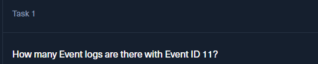

We filter the current log by Event ID `11`.

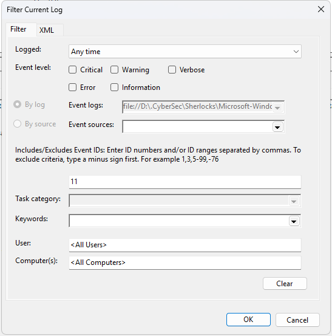

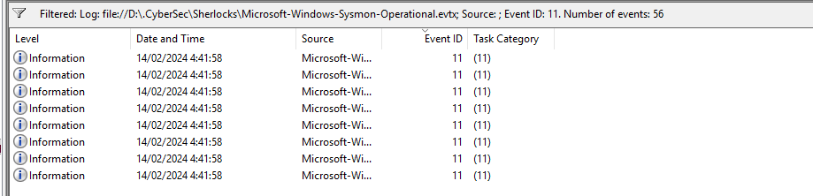

And it says we got `56`.

# Task 2

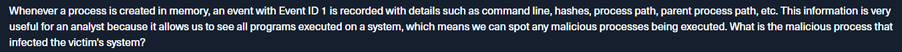

> Whenever a process is created in memory, an event with Event ID 1 is recorded with details such as command line, hashes, process path, parent process path, etc. This information is very useful for an analyst because it allows us to see all programs executed on a system, which means we can spot any malicious processes being executed. What is the malicious process that infected the victim's system?

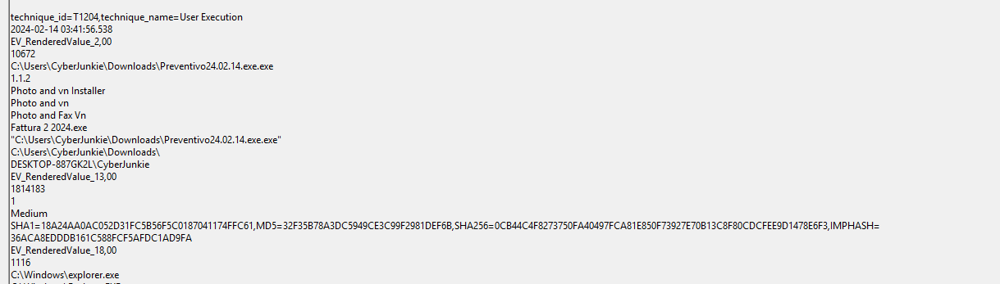

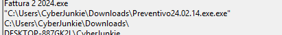

We search for Event ID `1` and we find a weird `.exe` called `Preventio`.

# Task 3

Seconds before the execution of `Preventio`, we find Mozilla downloading files:

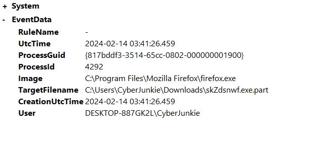

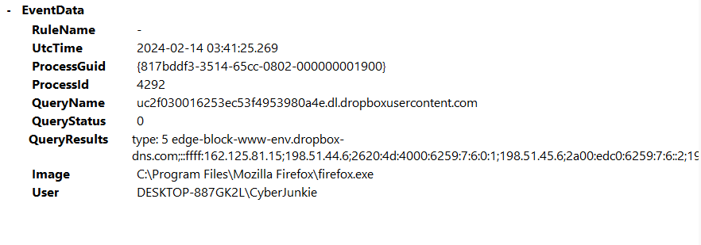

We find a DNS query to Dropbox and immediately after that is when Mozilla creates the new file.

# Task 4

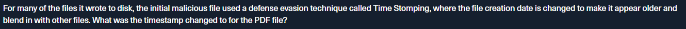

> For many of the files it wrote to disk, the initial malicious file used a defense evasion technique called Time Stomping, where the file creation date is changed to make it appear older and blend in with other files. What was the timestamp changed to for the PDF file?

For the file creation time change, we're looking for Sysmon Event ID `2`.

Then we find a `.pdf` file that changes its file creation time from February 14 to January 14.

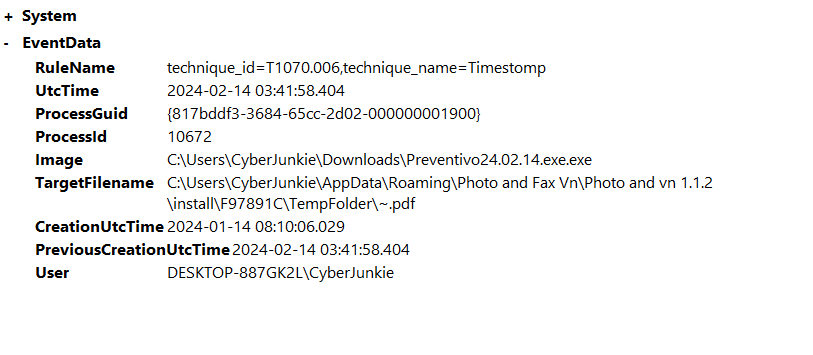

# Task 5

We go back to look for file creation Event ID `11`.

We can also combine the find tool so we only search through all Event ID `11` events for `once.cmd`.

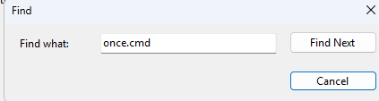

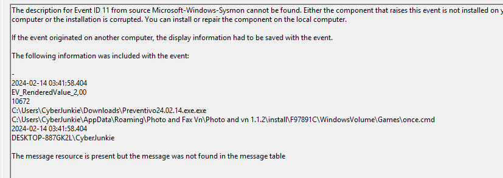

Landing a location.

# Task 6

To see what domain connections have been made or attempted, we need to look for Event ID `22` - DNS Query.

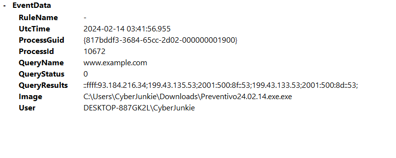

We find `www.example.com`.

# Task 7

In the same event, we can see the IP:

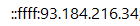

`::ffff:` is a prefix.

# Task 8

To look for process termination, we want to look for Sysmon Event ID `5`.

And we find a single event.

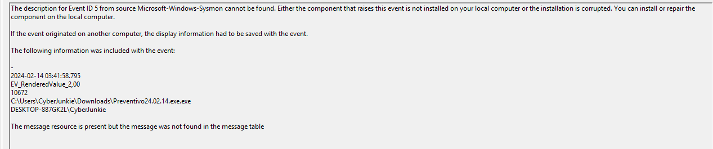

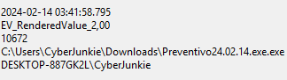